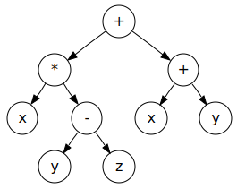

# New decade, new delusions

Over the last decade, I bet on some strange ideas. A lot of the people I looked up to at the time laughed at me. I'll bet they aren't laughing anymore. I ought to thank them one day, because their laughter gave me a lot of motivation over the years.

In 2012, I was in Austin sitting next to an ex-poker player named [Amir](https://twitter.com/amirpc) who was excited about Hinton's work. I poured over his technicolor slides and something must have clicked, because I quit my job in a hurry and started [an educational project](http://breandan.net/2014/02/09/the-end-of-illiteracy/) using speech recognition and restricted Boltzman machines. It never panned out, but I learned a lot about speech recognition and Android audio. Still love that idea.

In 2016, I quit my next job as a tech evangelist to [run around the world](http://breandan.net/2016/12/27/traveling-tales/) giving incoherent talks about deep learning. I met Yoshua at the United Nations. He encouraged me to study in Canada. I applied to UofT and UdeM. Ended up at UdeM because I hate asking for recommendations, and they were the only ones who didn't care about them anyway. Best decision I ever made. Move to Montreal, thank me later. 

In 2017, I started writing a book on the ethics of automation and [predicted](http://breandan.net/2017/02/02/trust-in-automation/) mass unemployment and social unrest. Although I got the automation wrong (pandemic, go figure), the information economy and bias stuff were all dead right. Sadly, the worst parts came true faster than I imagined and are now driving the world completely insane.

[](https://colah.github.io/posts/2015-09-NN-Types-FP/)

In 2017, I saw the rise of differentiable programming, which I stole from Chris Olah and turned into a [master's thesis](https://github.com/breandan/kotlingrad/blob/master/latex/thesis/thesis.pdf). Wrote a lot of arrogant whig historiography that my advisors pleaded with me to cut, but even they'll admit we got some things right. Look at the proceedings of any ML conference today and you'll find dozens of papers on differentiable sorting and rendering and simulation. [Types](https://github.com/tensorflow/tensorflow/issues/12345) are [coming](https://docs.python.org/3.9/whatsnew/3.9.html#pep-585-builtin-generic-types). Don't thank me, thank Chris and the Theano guys.

In 2018, I bet on big code and ML4SE. A lot of people saw this coming, but I correctly predicted Microsoft would acquire GitHub to mine code. Why MS and not Google? I'll bet they tried, but Google's leadership had fantasies of AGI and besides JetBrains, MS were the only ones who gave a damn about developers. They haven't fully cracked the code yet, but synthesis is starting to trickle into [real](https://github.com/JetBrains-Research/DeepBugsPlugin) [products](https://devblogs.microsoft.com/visualstudio/ai-assisted-intellisense-for-your-teams-codebase/).

<blockquote class="twitter-tweet"><p lang="en" dir="ltr">Prediction: MS will acquire GH within five years. If the <a href="https://twitter.com/hashtag/ML4Code?src=hash&amp;ref_src=twsrc%5Etfw">#ML4Code</a> stuff delivers for MS, acquisition is highly likely. Although it would have been cheaper a few years ago. <a href="https://t.co/5ZMtiRtifD">https://t.co/5ZMtiRtifD</a> <a href="https://t.co/TaxkArm5ps">https://t.co/TaxkArm5ps</a></p>&mdash; breandan (@breandan) <a href="https://twitter.com/breandan/status/993553301927936001?ref_src=twsrc%5Etfw">May 7, 2018</a></blockquote> <script async src="https://platform.twitter.com/widgets.js" charset="utf-8"></script>

[](https://blogs.microsoft.com/blog/2018/10/26/microsoft-completes-github-acquisition/)

I can't claim credit for any of these ideas, I'm no genius. I just show up and listen to the right people. Some call it privilege, some call it luck. Call it what you want. Perhaps you think I'm just another washed up brogrammer with an ego and axe to grind, and perhaps you're not wrong. Whatever my flaws, God gave me two gifts. I can spot good ideas (sometimes), and I can write about them (poorly).

This year, I predicted the pandemic weeks before the lockdown, exited the market, and turned down a job at Google. They called me crazy. Now I'm going all-in on some new ideas (none of which are mine). I'm making some big bets and some may be wrong, but I see the very same spark of truth in them. Hang on to your hats, because if I'm right, these things are going to shake the foundations of modern computing.

# Everything old is new again

As a kid, I was given a book on the history of mathematics. I remember it had some interesting puzzles, including one with bridges and a man called Euler. Which towns had a path crossing each bridge exactly once? Did they have anything in common? I remember spending days drawing little graphs to figure this out.

[](https://en.wikipedia.org/wiki/Seven_Bridges_of_K%C3%B6nigsberg)

In the late 90s, my mom and I went to Ireland. I remember visiting Trinity College, and learning about a man called Hamilton who found some kind of deep connection between algebra and geometry, and carved the formula onto a bridge. We visited the bridge, and the tour guide pointed out the stone, which we touched for good luck. The Irish have a thing for stones.

[](http://www.kurims.kyoto-u.ac.jp/EMIS/classics/Hamilton/PRIAIcos.pdf)

In 2007, when applying to college, I took the Amtrack Lake Shore Limited from Boston to South Bend, Indiana, home of the Fighting Irish. Wandering about, I came to the computing department, where I found a magazine by a Hungarian called [Albert](https://en.wikipedia.org/wiki/Albert-L%C3%A1szl%C3%B3_Barab%C3%A1si) who had some interesting things to say about "scale-free networks". There was something beautiful about that idea. I still have the magazine.

[](https://barabasi.com/f/226.pdf)

In 2009, while a student in Rochester, I [carpooled](../images/complex_network_seminar.png) with a [nice professor](https://twitter.com/hguclu) who was enthusiastic about complex networks. I learned complex networks are found in brains, languages and social networks. I remember being very excited about this and its implications for the study of intelligence. Nothing seemed to come of it, until recently.

In 2017, I spent some time with folks interested in algorithmic differentiation. Olivier Breleux presented [Myia](https://github.com/mila-iqia/myia) and [Buche](https://github.com/breuleux/buche). Matt Johnson gave a talk on [Autograd](https://github.com/HIPS/autograd) which left an impression on me. I met Chris Olah in Long Beach, who gave me the idea to study [differentiable programming](https://colah.github.io/posts/2015-09-NN-Types-FP/). I stole his idea, dressed it up in Kotlin and traded it for a POPL workshop paper and later a [Master's thesis](https://github.com/breandan/kotlingrad/blob/master/latex/thesis/thesis.pdf). Our contributions were mostly algebra, shapes and casting AD as a transformation on a dataflow graph.

[](https://github.com/breandan/kotlingrad#dataflow-graphs)

In 2019, I joined a lab with a [nice professor](https://www.cs.mcgill.ca/~jguo/) interested in applying knowledge graphs to software engineering. Knowledge graphs are an old idea from the first wave of AI in the 1960s and 70s. I believe this is an important area of research with a lot of potential. Knowledge and connectivity plays an important role in software, and it's the bread-and-butter of a good IDE. The world needs better IDEs if we're ever going to untangle this mess we're in.

[](https://structurizr.com/)

This Spring, I took a seminar in Graph Representation Learning. A lot of graph theory had been worked out over the preceeding decade. PageRank turned into power iteration. People made some interesting connections to linear algebra, including Weisfeiler-Lehman graph kernels, graph Laplacians and spectral graph theory. Graph synthesis is starting to show real promise.

# Graphs, inductively

Graphs are general-purpose data structures used to represent many data types and procedural phenomena. Consider the following hierarchy of graphs, from least to greatest expressiveness:

- **Sets**: data, multisets, posets, symbols
- **Sequences**: Lists, strings, traces, linear function composition
- **Trees**: [Abstract syntax trees](https://en.wikipedia.org/wiki/Abstract_syntax_tree), [document object model](https://en.wikipedia.org/wiki/Document_Object_Model), [phylogenic trees](https://en.wikipedia.org/wiki/Phylogenetic_tree), [decision trees](https://en.wikipedia.org/wiki/Decision_tree)
- **DAGs**: [Git](https://eagain.net/articles/git-for-computer-scientists/), [control flow](https://en.wikipedia.org/wiki/Control-flow_graph), [citation networks](https://en.wikipedia.org/wiki/Citation_network), [dependency graphs](https://en.wikipedia.org/wiki/Dependency_graph), MLPs
- **Directed graphs**: [State machines](https://en.wikipedia.org/wiki/Finite-state_machine), [lambda calculus](http://dkeenan.com/Lambda/), [web pages](https://computersciencewiki.org/index.php/The_web_as_a_directed_graph), [call graphs](https://en.wikipedia.org/wiki/Call_graph), RNNs
- **Hypergraphs**: [Knowledge graphs](https://arxiv.org/pdf/2003.02320.pdf), [Zettelkasten](https://zettelkasten.de/), [categories](https://en.wikipedia.org/wiki/Category_theory), [the universe](https://writings.stephenwolfram.com/2020/04/finally-we-may-have-a-path-to-the-fundamental-theory-of-physics-and-its-beautiful/)

Graphs are often used to represent mathematical notation as I show in [Kotlin∇](https://github.com/breandan/kotlingrad). Graphs can also be used to represent other programming languages, including source code, intermediate representations and markup languages. There are many recent examples of learning graphs for symbolic applications:

* [Deep Learning for Symbolic Mathematics](https://arxiv.org/abs/1912.01412)
* [Discovering Symbolic Models from Deep Learning with Inductive Biases](https://arxiv.org/pdf/2006.11287.pdf)
* [Symbolic Pregression: Discovering Physical Laws from Raw Distorted Video](https://arxiv.org/pdf/2005.11212.pdf)

Graphs are also used to model natural language, including [constituency](https://en.wikipedia.org/wiki/Phrase_structure_grammar) and [dependency grammars](https://en.wikipedia.org/wiki/Dependency_grammar), [link grammars](https://en.wikipedia.org/wiki/Dependency_grammar) and other syntactic and semantic relationships between natural language entities.


[Knowledge graphs](https://arxiv.org/pdf/2003.02320.pdf) are another important type of graph used to represent relations between concepts, e.g. on wikis and other web based content management systems.


One thing that fascinates me about programming languages is the idea of inductively defined grammars:

```
<exp> := x | y | z
<exp> := <exp> + <exp>
<exp> := <exp> – <exp>
<exp> := <exp> * <exp>
<exp> := <exp> / <exp>
<exp> := (<exp>)
```

Each time you expand an `<exp>` with another production rule, this generates a rooted subtree on the operator, whose leaves are the operands.


 
 This tree becomes a directed acyclic graph if you merge equivalent operands. DAG are trees with a gemel.
 


What happens Similarly, it is possible to define graphs inductively.

```
type Node        = Int
type Adj b       = [(b, Node)]
type Context a b = (Adj b, Node, a, Adj b)
type Graph a b   = Empty | Context a b & Graph a b
```

Another definition of a graph is an adjacency matrix containing nodes V and edges E, where:

<span class='mathquote'>$$
\begin{align*}
    \mathbf A \in \mathbb \mathbb B ^{|V|\times|V|} \text{ where } \mathbf A\[u, v\] = 
    \begin{cases}
       1,& \text{if } u, v \in E \\
       0,& \text{otherwise}
    \end{cases}
\end{align*}
$$</span>

# Graphs, algebraically

What happens if we define some operators on graphs, such as addition and multiplication? How would we do that, and what does it mean?

# Graphs, efficiently

A lot of the stuff in Graph Representation Learning is motivated by computational constraints. You can't instantiate the adjacency matrix, because it's too large, so you need all kinds of mathematical tricks to sum over or approximate it. But most graphs are sparse and have all kinds of symmetries. Finding the right graph embedding can get you real far...