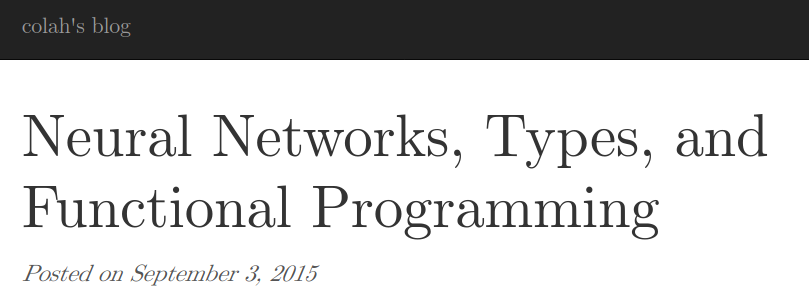
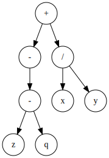
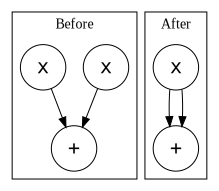
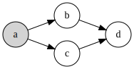

# New decade, new delusions

Over the last decade, I bet on some strange ideas. A lot of the people I looked up to at the time laughed at me. I'll bet they aren't laughing anymore. I ought to thank them one day, because their laughter gave me a lot of motivation over the years.

In 2012, I was in Austin sitting next to an ex-poker player named [Amir](https://twitter.com/amirpc) who was excited about Hinton's work. I poured over his technicolor slides and something must have clicked, because I quit my job in a hurry and started [an educational project](http://breandan.net/2014/02/09/the-end-of-illiteracy/) using speech recognition and restricted Boltzman machines. It never panned out, but I learned a lot about speech recognition and Android audio. Still love that idea.


In 2016, I quit my next job as a tech evangelist to [run around the world](http://breandan.net/2016/12/27/traveling-tales/) giving incoherent talks about deep learning. I met Yoshua at the United Nations. He encouraged me to study in Canada. I applied to UofT and UdeM. Ended up at UdeM because I hate asking for recommendations, and they were the only ones who didn't care about them anyway. Best decision I ever made. Move to Montreal, thank me later. 

In 2017, I started writing a book on the ethics of automation and [predicted](http://breandan.net/2017/02/02/trust-in-automation/) mass unemployment and social unrest. Although I got the causes wrong (pandemic, go figure), the information economy and bias takes were all dead right. Sadly, the worst parts came true faster than I imagined and are now driving the world completely insane. Don't thank me, go out and fix our broken systems. The world needs more engineers who care.

[](https://colah.github.io/posts/2015-09-NN-Types-FP/)

In 2017, I witnessed the birth of differentiable programming, which I stole from Chris Olah and turned into a [master's thesis](https://github.com/breandan/kotlingrad/blob/master/latex/thesis/thesis.pdf). Had a lot of trouble convincing people that programs could be made differentiable, but look at the proceedings of any machine learning conference today and you'll find dozens of papers on differentiable sorting and rendering and simulation. [Types](https://github.com/tensorflow/tensorflow/issues/12345) are [coming](https://docs.python.org/3.9/whatsnew/3.9.html#pep-585-builtin-generic-types). Don't thank me, thank Chris and the Theano guys.

In 2018, I bet on big code and ML4SE. This was pretty clear to a lot of people, but I correctly predicted Microsoft would acquire GitHub to mine code. Why MS and not Google? I'll bet they tried, but Google's leadership had fantasies of AGI and besides JetBrains, MS were the only ones who cared about developers. Now ML4SE is a thriving research area and showing up in [real](https://github.com/JetBrains-Research/DeepBugsPlugin) [products](https://devblogs.microsoft.com/visualstudio/ai-assisted-intellisense-for-your-teams-codebase/).

<blockquote class="twitter-tweet"><p lang="en" dir="ltr">Prediction: MS will acquire GH within five years. If the <a href="https://twitter.com/hashtag/ML4Code?src=hash&amp;ref_src=twsrc%5Etfw">#ML4Code</a> stuff delivers for MS, acquisition is highly likely. Although it would have been cheaper a few years ago. <a href="https://t.co/5ZMtiRtifD">https://t.co/5ZMtiRtifD</a> <a href="https://t.co/TaxkArm5ps">https://t.co/TaxkArm5ps</a></p>&mdash; breandan (@breandan) <a href="https://twitter.com/breandan/status/993553301927936001?ref_src=twsrc%5Etfw">May 7, 2018</a></blockquote> <script async src="https://platform.twitter.com/widgets.js" charset="utf-8"></script>

[](https://blogs.microsoft.com/blog/2018/10/26/microsoft-completes-github-acquisition/)

This year, I predicted the pandemic weeks before the lockdown, exited the market, and turned down a job at Google. Some people called me crazy. Now I'm going all-in on some new ideas (none of which are mine). I'm making some big bets and some may be wrong, but I see the very same spark of genius in them. Hang on to your hats, because if I'm right, these things are going to shake the foundations of modern computing.

# Everything old is new again

As a kid, I was given a book on the history of mathematics. I remember it had some interesting puzzles, including one with [some bridges](https://en.wikipedia.org/wiki/Seven_Bridges_of_K%C3%B6nigsberg) and a man called Euler. Which towns had a path crossing each bridge exactly once? Was it possible to tell without trying every path? I remember spending days drawing little maps to figure this out.

[](https://en.wikipedia.org/wiki/Seven_Bridges_of_K%C3%B6nigsberg)

In the late 90s, my mom and I went to Ireland. I remember visiting Trinity College, and learning about a mathematician called [Hamilton](https://en.wikipedia.org/wiki/William_Rowan_Hamilton) who discovered a formula connecting algebra and geometry, and carved it onto a [bridge](https://en.wikipedia.org/wiki/Broom_Bridge). We later visited the bridge, and the tour guide pointed out the stone, which we touched for good luck. The Irish have a [thing](https://en.wikipedia.org/wiki/Poulnabrone_dolmen) for [stones](https://en.wikipedia.org/wiki/Newgrange).

[](http://www.kurims.kyoto-u.ac.jp/EMIS/classics/Hamilton/PRIAIcos.pdf)

In 2007, when applying to college, I took the Amtrack Lake Shore Limited from Boston to South Bend, Indiana, home of the Fighting Irish. Wandering about, I came to the computing department, where I found a magazine by a Hungarian mathematician called [Barabási](https://en.wikipedia.org/wiki/Albert-L%C3%A1szl%C3%B3_Barab%C3%A1si) who had some interesting things to say about [complex networks](https://en.wikipedia.org/wiki/Complex_network). There was something beautiful about that idea. I still have the magazine.

[](https://barabasi.com/f/226.pdf)

In 2009, while a student in Rochester, I [carpooled](../images/complex_network_seminar.png) with a [nice professor](https://avesis.medeniyet.edu.tr/hasan.guclu) who was enthusiastic about complex networks, which are found in brains, languages, social networks and many other interesting places. I remember being very excited about this and its implications for the study of intelligence. Nothing seemed to come of it, until recently.

In 2017, I spent some time around folks working on algorithmic differentiation. Olivier Breleux presented [Myia](https://github.com/mila-iqia/myia) and [Buche](https://github.com/breuleux/buche). Matt Johnson gave a talk on [Autograd](https://github.com/HIPS/autograd) which left an impression on me. I met Chris Olah in Long Beach, who gave me the idea to study [differentiable programming](https://colah.github.io/posts/2015-09-NN-Types-FP/). I stole his idea, dressed it up in Kotlin and traded it for a POPL workshop paper and later a [Master's thesis](https://github.com/breandan/kotlingrad/blob/master/latex/thesis/thesis.pdf). Our contributions were algebra, shapes inference and presenting AD as term rewriting. But forget all that -- if I had only one idea to give these ML people, I would choose types. Types are the foundation of any automated reasoning system. Without them, you're as good as blind.

[](https://github.com/breandan/kotlingrad#dataflow-graphs)

In 2019, I joined a lab with a [nice professor](https://www.cs.mcgill.ca/~jguo/) at McGill working on applying knowledge graphs to software engineering. Knowledge graphs are an old idea from the first wave of AI in the 1960s and 70s which had recently been revived and studied in light of recent progress in representation learning on graphs. I believe this is an important area of research with a lot of potential. Knowledge and traceability plays an important role in software engineering, and it's the bread-and-butter of a good IDE. The world needs better IDEs if we're ever going to untangle this mess we're in.

[](https://structurizr.com/)

This Spring, I took a fascinating [seminar on Graph Representation Learning](https://cs.mcgill.ca/~wlh/comp766/index.html). A lot of graph theory had been worked out over the preceding decade. [PageRank](https://en.wikipedia.org/wiki/PageRank) turned into power iteration. People made some interesting connections to linear algebra, including Weisfeiler-Lehman graph kernels, graph Laplacians and spectral graph theory. Graph synthesis is starting to show real promise. The key idea here is there are some very elegant mathematics for representing graphs, and choosing the right representation is very powerful. More on that later.

# What are graphs?

Graphs are general-purpose data structures used to represent many data types and procedural phenomena. Consider the following hierarchy of graphs, from least to greatest expressiveness:

- **Sets**: data, multisets, posets, symbols
- **Sequences**: Lists, strings, traces, linear function composition
- **Trees**: [Abstract syntax trees](https://en.wikipedia.org/wiki/Abstract_syntax_tree), [document object model](https://en.wikipedia.org/wiki/Document_Object_Model), [phylogenic trees](https://en.wikipedia.org/wiki/Phylogenetic_tree), [decision trees](https://en.wikipedia.org/wiki/Decision_tree)
- **DAGs**: [Git](https://eagain.net/articles/git-for-computer-scientists/), [control flow](https://en.wikipedia.org/wiki/Control-flow_graph), [citation networks](https://en.wikipedia.org/wiki/Citation_network), [dependency graphs](https://en.wikipedia.org/wiki/Dependency_graph), MLPs
- **Directed graphs**: [State machines](https://en.wikipedia.org/wiki/Finite-state_machine), [lambda calculus](http://dkeenan.com/Lambda/), [web pages](https://computersciencewiki.org/index.php/The_web_as_a_directed_graph), [call graphs](https://en.wikipedia.org/wiki/Call_graph), RNNs
- **Hypergraphs**: [Knowledge graphs](https://arxiv.org/pdf/2003.02320.pdf), [Zettelkasten](https://zettelkasten.de/), [categories](https://en.wikipedia.org/wiki/Category_theory), [the universe](https://writings.stephenwolfram.com/2020/04/finally-we-may-have-a-path-to-the-fundamental-theory-of-physics-and-its-beautiful/), hypernetworks

Graphs are often used to represent mathematical notation as I show in [Kotlin∇](https://github.com/breandan/kotlingrad). Graphs can also be used to represent other programming languages, including source code, intermediate representations and markup languages. There are many recent examples of learning graphs for symbolic applications:

* [Deep Learning for Symbolic Mathematics](https://arxiv.org/abs/1912.01412)
* [Discovering Symbolic Models from Deep Learning with Inductive Biases](https://arxiv.org/pdf/2006.11287.pdf)
* [Symbolic Pregression: Discovering Physical Laws from Raw Distorted Video](https://arxiv.org/pdf/2005.11212.pdf)

Graphs are also used to model natural language, including [constituency](https://en.wikipedia.org/wiki/Phrase_structure_grammar) and [dependency grammars](https://en.wikipedia.org/wiki/Dependency_grammar), [link grammars](https://en.wikipedia.org/wiki/Dependency_grammar) and other syntactic and semantic relationships between natural language entities.


[Knowledge graphs](https://arxiv.org/pdf/2003.02320.pdf) are another important type of graph used to represent relations between concepts, e.g. on wikis and other web based content management systems.


Lo and behold, the key idea behind knowledge graphs is our old friend, types. Knowledge graphs are graphs whose nodes and edges have a type. This is useful information retrieval, since we can build an index on type, but also for reasoning about queries over the graph, such as "Which companies have a direct flight from a port city to a capital city?"

# Graphs, inductively

One thing that fascinates me about programming languages is the idea of inductively defined grammars. The following grammar generates a 3-variable algebra:

```
<exp> := x | y | z
<exp> := <exp> + <exp>
<exp> := <exp> – <exp>
<exp> := <exp> * <exp>
<exp> := <exp> / <exp>
<exp> := (<exp>)
```

Each time you expand an `<exp>` with another production rule, this generates a rooted subtree on the operator, whose leaves are the operands.

|Syntax Tree| Peach Tree|
|-----------|-----------|
||
 
 This tree becomes a directed acyclic graph if you merge equivalent operands. DAG are trees with a gemel.

|DAG|Gemel|
|---|----|
|||

Similarly, it is possible to define graphs inductively.

```
type Node        = Int
type Adj b       = [(b, Node)]
type Context a b = (Adj b, Node, a, Adj b)
type Graph a b   = Empty | Context a b & Graph a b
```

Another definition of a graph is an adjacency matrix containing nodes V and edges E, where:

<span class='mathquote'>$$
\begin{align*}
    \mathbf A \in \mathbb \mathbb B ^{|V|\times|V|} \text{ where } \mathbf A\[u, v\] = 
    \begin{cases}
       1,& \text{if } u, v \in E \\
       0,& \text{otherwise}
    \end{cases}
\end{align*}
$$</span>

# Graphs, grammatically

Consider the following system of rules, which operate on computation graphs, just like before, we can apply the rules to transform the graph:

(R1) D<sub>x</sub>(X) := 1

(R2) D<sub>x</sub>(Y) := 0

(R3) D<sub>x</sub>(u+v) := D<sub>x</sub>(u) + D<sub>x</sub>(v)

(R4) D<sub>x</sub>(u⋅v) := u⋅D<sub>x</sub>(v) + D<sub>x</sub>(u)⋅v

This generates the following graph:

|Graph|Map|
|-----|---|
|||

This property is called confluence.

Graph grammars are grammars on graphs. 

Single/Double pushout

# Graphs, automatically

Consider the [elementary cellular automata](https://en.wikipedia.org/wiki/Elementary_cellular_automaton), which consists of a one dimensional array, and a 3-cell rewrite grammar. There are 2<sup>2<sup>3</sup></sup>=256 rules for rewriting the tape. 


It turns out even in this simple space, there are remarkable automata. The following rule is Turing complete:

| current pattern           | `111` | `110` | `101` | `100` | `011` | `010` | `001` | `000` |
| ------------------------- | --- | --- | --- | --- | --- | --- | --- | --- |
| new pattern | ` 0 `  | ` 1 `  | ` 1 `  | ` 0 `  | ` 1 ` | ` 1 `  | ` 1 `  | ` 0 `  |

Consider the lambda calculus, which is also Turing complete. It consists of the following rules:

...

This can be represented graphically:

...

# Graphs, algebraically
  
What happens if we define some operators on graphs, such as addition and multiplication? How would we do that, and what does it mean?

Naively, a directed graph is just a square boolean matrix whose values indicate edges between nodes. Just like real matrices in linear algebra, we can add, subtract, multiply and exponentiate them.

One interesting game mathematicians like to play is taking a square matrix R^2 and raise it to a power. There are various tricks for designing the matrix and normalizing the product so it does not explode or vanish. This has many important applications in control theory and dynamical systems.

Another interesting game that mathematicians like to play is to take iterated matrix-vector products. One way to think about this is MMMV. Another way is M(M(M(V))), where M is a function on a vector space. These are equivalent. Matrices are functions on a vector spaces.

It turns out the very same method can be applied to Z^2 and has many interesting applications for graph theory.


# Graphs, computationally

One of the earliest examples of graph computation can be found in Valiant, 1975.

<blockquote class="twitter-tweet"><p lang="en" dir="ltr">TIL: CFL parsing can be reduced to boolean matrix multiplication (Valiant, 1975), known to be subcubic (Strassen, 1969), and later proven an asymptotic lower bound (Lee, 1997). This admits efficient GPGPU implementation (Azimov, 2017) in <a href="https://twitter.com/YaccConstructor?ref_src=twsrc%5Etfw">@YaccConstructor</a> <a href="https://t.co/3Vbml0v6b9">https://t.co/3Vbml0v6b9</a></p>&mdash; breandan (@breandan) <a href="https://twitter.com/breandan/status/1277136195118600192?ref_src=twsrc%5Etfw">June 28, 2020</a></blockquote> <script async src="https://platform.twitter.com/widgets.js" charset="utf-8"></script>

- Finite automata
- Buchi automata
- Pushdown automata

All of these things can be evolved using matrix multiplication.

## Linear chains

<table>
<tr>
<td> <b>Graph</b> </td> <td> <b>Matrix</b> </td> <td> <b>S</b> </td><td> <b>S'</b> </td>
</tr>
<tr>
<td> 
 


</td>
<td>

```
    a  b  c
   ________
a | 0  0  0
b | 1  0  0
c | 0  1  1
```

</td>
<td>

```


1
0
0
```

</td>
<td>

```


0
1
0
```

</td>
</tr>
<tr>
<td> 
 


</td>
<td>

```
    a  b  c
   ________
a | 0  0  0
b | 1  0  0
c | 0  1  1
```

</td>
<td>

```


0
1
0
```

</td>
<td>

```


0
0
1
```

</td>
</tr>
<tr>
<td> 
 


</td>
<td>

```
    a  b  c
   ________
a | 0  0  0
b | 1  0  0
c | 0  1  1
```

</td>
<td>

```


0
0
1
```

</td>
<td>

```


0
0
1
```

</td>
</tr>
</table>

## Directed acyclic graphs

<table>
<tr>
<td> <b>Graph</b> </td> <td> <b>Matrix</b> </td> <td> <b>S</b> </td><td> <b>S'</b> </td>
</tr>
<tr>
<td> 
 


</td>
<td>

```
    a  b  c  d
   ___________
a | 0  0  0  0
b | 1  0  0  0
c | 1  0  0  0
d | 0  1  1  1
```

</td>
<td>

```


1
0
0
0
```

</td>
<td>

```


0
1
1
0
```

</td>
</tr>
<tr>
<td> 
 


</td>
<td>

```
    a  b  c  d
   ___________
a | 0  0  0  0
b | 1  0  0  0
c | 1  0  0  0
d | 0  1  1  1
```

</td>
<td>

```


0
1
1
0
```

</td>
<td>

```


0
0
0
1
```

</td>
</tr>
<tr>
<td> 
 


</td>
<td>

```
    a  b  c  d
   ___________
a | 0  0  0  0
b | 1  0  0  0
c | 1  0  0  0
d | 0  1  1  1
```

</td>
<td>

```


0
0
0
1
```

</td>
<td>

```


0
0
0
1
```

</td>
</tr>

</table>

We encode the last node as a self cycle in order to detect the fixpoint.

## Dataflow graphs

Suppose we have the function `f(a, b) = (a + b) * b` and want to compute `f(2, 3)`.

<table>
<tr>
<td> <b>Graph</b> </td> <td> <b>Matrix</b> </td> <td> <b>S</b> </td><td> <b>S'</b> </td>
</tr>
<tr>
<td> 
 


</td>
<td>

```
    a  b  +  *
   ___________
a | 0  0  0  0
b | 0  0  0  0
+ | 1  1  0  0
* | 0  1  1  1
```

</td>
<td>

```


2
3
0
0
```

</td>
<td>

```


0
0
5
3
```

</td>
</tr>
<tr>
<td> 
 


</td>
<td>

```
    a  b  +  *
   ___________
a | 0  0  0  0
b | 0  0  0  0
+ | 1  1  0  0
* | 0  1  1  1
```

</td>
<td>

```


0
0
5
3
```

</td>
<td>

```


0
0
0
15
```

</td>
</tr>
<tr>
<td> 
 


</td>
<td>

```
    a  b  +  *
   ___________
a | 0  0  0  0
b | 0  0  0  0
+ | 1  1  0  0
* | 0  1  1  1
```

</td>
<td>

```


0
0
0
15
```

</td>
<td>

```


0
0
0
15
```

</td>
</tr>

</table>

# Graphs, efficiently

One issue with efficient representation of graphs is space complexity. Suppose we have a graph with 10<sup>5</sup>=100,000 nodes, but only a single edge. We will need 10<sup>5*2</sup> bits, or about 1 GB to store it in adjacency matrix form, whereas if we use an adjacency list, we will need only ⌈ 2\*log<sub>2</sub>10<sup>5</sup> ⌉ = 34 bits. Most graphs are similarly sparse. But how do you multiply adjacency lists? Unclear. The solution is to use sparse matrices. That was easy.

Another, thornier, problem with graph algorithms is their time complexity. Many interesting problems on graphs are NP-complete, including Hamiltonian paths and subgraph isomorphism. If so, how are we supposed to do any computation if every operation may take nondeterminstic polynomial time? Computer science people are mostly concerned with worst case complexity, which is practically never going to happen. Real world graphs can be solved quickly using approximate algorithms, such as Weisfeiler-Lehman algorithm. My colleague David Bieber has a nice [blog post](https://davidbieber.com/post/2019-05-10-weisfeiler-lehman-isomorphism-test/) about this. I'll focus on the implementation.

First, we need a pooling operator, which aggregates all neighbors on a vertex's ego graph:

```kotlin
fun <R> poolBy(op: Set<Vertex>.() -> R): Map<Vertex, R> =
  nodes.map { it to op(it.neighbors()) }.toMap()
```

Next we need a histogram operator, which simply counts how many neighbors each node has. This is the degree matrix, sparisfied:

```kotlin
val histogram: Map<Vertex, Int> by lazy { poolBy { size } }
```

Now we're ready to define the Weisfeiler-Lehman operator, which recursively computes a hash on the histogram for `k` steps.

```kotlin
tailrec fun wl(k: Int, labels: Map<Vertex, Int>): Map<Vertex, Int> =
  if (k <= 0) labels
  else wl(k - 1, poolBy { map { labels[it]!! }.sorted().hashCode() })
```

The hashcode of the entire graph is the hash code of the WL labels. With one round, we're just comparing the degree historgram. The more rounds we use, the more likely it is to detect a symmetry breaking issue:

```kotlin
override fun Graph.hashCode(steps: Int = 10) = 
    wl(steps, histogram).values.sorted().hashCode()
```

Now we can define an isomorphism test to if one graph is isomorphic to entire graph:

```kotlin
fun Graph.isIsomorphicTo(that: Graph) =
  nodes.size == that.nodes.size && 
  numOfEdges == that.numOfEdges && 
  hashCode() == that.hashCode()
```

Now we're done. This algorithm works on almost every graph you will ever encounter. That was easy!

We can encode a program as a graph.

<blockquote class="twitter-tweet"><p lang="en" dir="ltr">Prediction: In 20 years, most of today&#39;s ISAs (x86, ARM, MIPS) will be virtual or obsolete. Underneath the hood, everything will be sparse matmuls running on a homogeneous silicon mesh. Physical CPUs will be like gasoline engines - marvels of engineering, but far too complicated.</p>&mdash; breandan (@breandan) <a href="https://twitter.com/breandan/status/1278139598942679041?ref_src=twsrc%5Etfw">July 1, 2020</a></blockquote> <script async src="https://platform.twitter.com/widgets.js" charset="utf-8"></script> 

A lot of the stuff in Graph Representation Learning is motivated by computational constraints. You can't instantiate the adjacency matrix, because it's too large, so you need all kinds of mathematical tricks to sum over or approximate it. But most graphs are sparse and have all kinds of symmetries. Finding the right graph embedding can get you real far...

# References

- [GRL Notes](https://cs.mcgill.ca/~wlh/comp766/notes.html)
- [Term Rewriting and All That](https://doi.org/10.1017/CBO9781139172752)
- [Representation of Events in Nerve Nets and Finite Automata](https://www.rand.org/content/dam/rand/pubs/research_memoranda/2008/RM704.pdf)