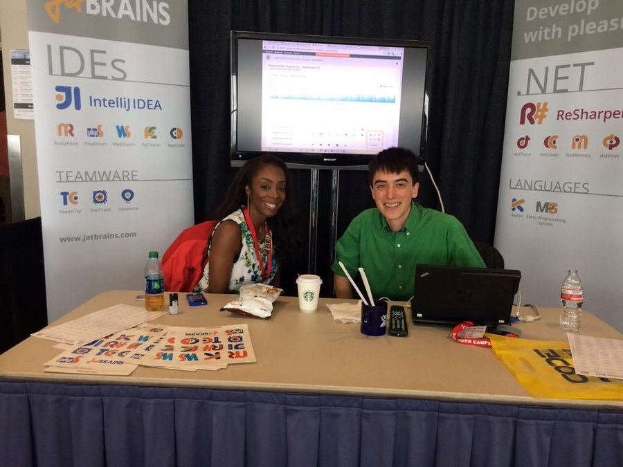
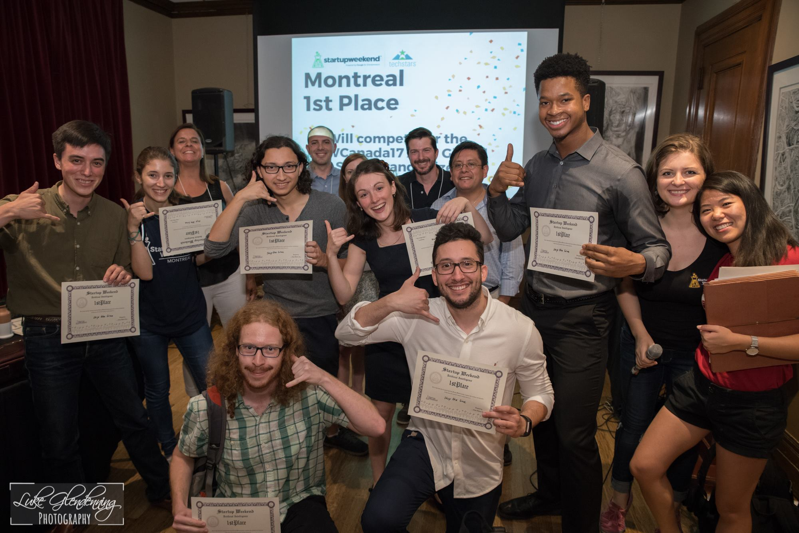
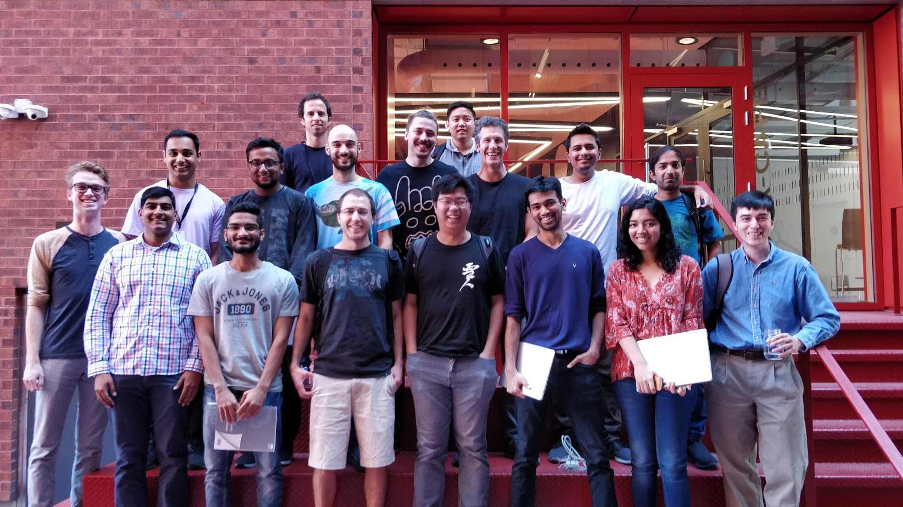
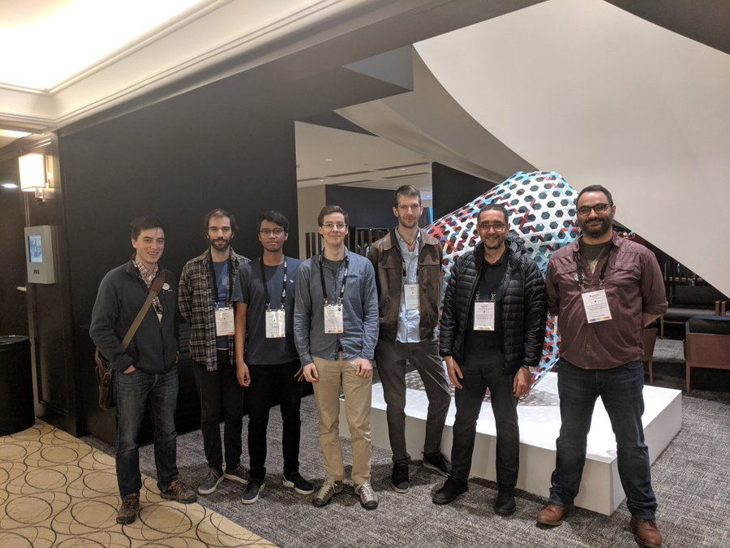
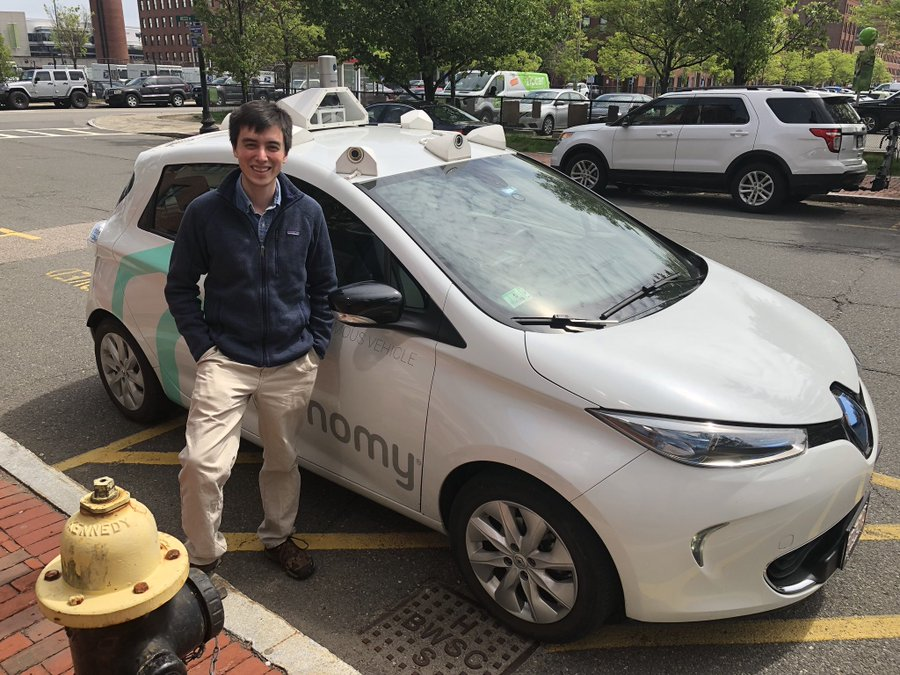

Hello! I am a Ph.D. student at McGill University, under the supervision of Jin Guo. The following blog post describes my journey to grad school, which I have decided to put into writing while my memory is still fresh. It is a hastily written, mostly unfiltered account, so if you're curious about graduate school or what academic research might be like, this is my best recollection of how that journey came about. My journey is not the best reference material, but a few people have asked me, so I will do my best to paint an accurate picture for those who are curious.

Following some recent events, I have been reflecting on the role of luck and merit in life. Unfortunately, these quantities are distributed far too unevenly in our society. All things considered, I am one of the luckiest people you will ever meet. Lest you think I am responsible for this good fortune, I have received an enormous amount of goodwill. So any credit I might be tempted to claim is really because I listened to the right people. I have tried to cite their influence in my journey. I hope that you too are forgiven your failures and allowed to chase your dreams as I have.

In 2014, I was hired as a technical evangelist, where I learned how to teach programming skills. For some reason, people paid me to write code on stage. I was never particularly good at this. But I met some extraordinary people who were. Learned a lot about developer tools and the tech industry at large. The way tech conferences work is that you write a few paragraphs about a technology of interest to their audience. Some person or committee looks it over and decides whether or not to accept it. Some conferences cover travel, room and board. There are other parts to the job, like company training and outreach, but that's the basic idea.

<figure>

<figcaption>
<small>Paige and I on booth duty in Houston circa 2014.</small>
</figcaption>
</figure>

Sometime around 2016, I realized I didn't have the faintest clue what I was talking about. I wanted to learn! So I tried applying to some graduate schools, but in order to be considered in the US, you must have taken the GRE and have academic letters of reference. By then, I had been out of school almost 5 years. So instead, I quit my job to run [around the world](http://breandan.net/2016/12/27/traveling-tales/) giving incoherent talks about machine learning. Along the way, I ran into Yoshua at the United Nations, who suggested studying in Canada. I submitted applications to a few schools and ended at UdeM because I hate asking people for recommendations, and they were one of the few places which didn't care about them anyway. One of the best decisions I made, in hindsight. Come to Montréal, thank me later.

After getting through a gamut of national and provincial immigration bureaucracy, I landed in Montréal in the Summer of 2017, which was then at the height of the AI fever. There were meetups and startups and signups for every imaginable thing that could possibly be described as AI. The whole city was in the middle of a [campaign](https://www.youtube.com/watch?v=LVXkISpbq2k) to rebrand itself as the Silicon Valley of the East, and eager to attract outside investment. Some friends and I signed up for a hackathon one weekend and they handed us a prize for a hypothetical startup and flew everyone to Paris. To be fair, the team had a good idea and worked hard for it, I mostly did some cheerleading.

<figure>

<figcaption>
<small>Startup/Hackathon at McGill circa 2017.</small>
</figcaption>
</figure>

In the Fall of 2017, I signed up for two classes. The first was a class on applied machine learning at McGill, a magical experience. The largest lecture halls in the university could barely contain us, spilling into the halls and aisles. The second was a small graduate class on autonomous vehicles, newly created at UdeM. Despite the growing pains, both were extremely well done. I met a lot of talented young people with big dreams, eager to make their mark on the world. I'm sure it was stressful at the time, but all I can remember was how thrilling it was to be back in school again, where nobody knew my name and the future was a blank page.

I asked a bunch of professors to let me do research. They all politely declined, but I kept trying until one agreed to hear me out. I proposed to improve the reproducibility of robotics software, which was becoming a bottleneck in their development pipeline. So, I became a Master's student at an energetic young lab working on [robotics](https://montrealrobotics.ca/). We reached out to our [software engineering](http://geodes.iro.umontreal.ca/en/) neighbors to collaborate on a hypothetical project at the intersection of learning, robotics and software. It was a bit of a stretch, but they gave me the benefit of the doubt and we were off to the races.

| Robotics and Embodied AI Lab (REAL) | Groupe de génie logiciel de l'UdeM (GEODES) |
|----|----|
|||

In the Winter of 2017, I went to my first NIPS, in Long Beach...

In the Spring of 2018, I decided to take three classes at once: machine learning theory, representation learning and reinforcement learning. This was a mistake in hindsight, but at the time I loved every moment of it. They taught us about Bayesian inference, Gibbs sampling, Wasserstein distances, convergence rates of SGD and Polyak's heavy ball method. We learned about Q-learning, Bellman equations and SARSA. This was all completely new to me and very challenging material, but luckily we had good instructors. Each Friday, the lab had a tradition of hosting tea talks which attracted some of leading researchers round the world, who flew in to give an informal lecture or two on related content. Arguably, few universities in the world had a better teaching experience.

In the Summer of 2018, I was given the opportunity to work as a robotics intern in either Silicon Valley or Boston. I chose to work on autonomous vehicles in Boston, which is a nice place in the summertime. The AV industry is a tough space with a lot of competition (still today). At the time, I was working on build automation, which was pretty simple by comparison. Wrote a bunch of documentation and build scripts for cross-compiling code on GPU simulators and ARM devices. Worked alongside some fantastic engineers, who had just recently moved into a fancy seafront office in Boston but were under a lot of pressure to deliver good results. It was all technically very interesting, but by then, my heart was set on automatic differentiation.

<figure>

<figcaption>
<small>Testing a robotaxi prototype in Boston.</small>
</figcaption>
<figcaption></figcaption>
</figure>

I returned to Montréal that Fall to give a [show-and-tell](https://montrealaisymposium.wordpress.com/accepted-papers-montreal-ai-symposium-2018/#post-162) with my colleagues Maxime and Manfred. By some miracle, we were able to pull it off, mostly to their credit. Classes resumed, and I worked as a TA at UdeM, helping prepare the second iteration of the class. I was fortunate that nuTonomy allowed the work I did in Boston to be open sourced and we were able to use it as infrastructure for the class and later an autonomous vehicles competition, debuting at NeurIPS conference later that Winter.

Duckietown: Software Infrastructure for Autonomous Robotics Development

<iframe src="https://player.vimeo.com/video/293296939" width="640" height="360" frameborder="0" allow="autoplay; fullscreen" allowfullscreen></iframe>

<a href="https://vimeo.com/293296939">ROSCon 2018 Madrid: Model-based Duckietown: Software Infrastructure for Autonomous Robotics Development</a> from <a href="https://vimeo.com/osrfoundation">OSRF</a> on <a href="https://vimeo.com">Vimeo</a>.

In the Fall, I went to Madrid to present my containerization work at [ROSCon](https://vimeo.com/293296939) and the Automating Robotics Experiments workshop at IROS 2018. I got to attend IROS, explore Madrid and see some great demos and talks, including one from the king of Spain, who made a surprise appearance.

<figure>

<figcaption>
<small>The first AI driving competition at NeurIPS.</small>
</figcaption>
</figure>

NeurIPS 2019 came and went. It was stressful but very gratifying to see the audience smile and a lot of fun for everyone involved. Around that time, I was notified that a POPL workshop paper I had submitted was accepted. So in January, I took a plane to Lisbon and took the train to Cascais to present some new work on automatic differentiation, which would later become the meat of my Master's thesis.

After spending a very happy two years at UdeM, I knew I wanted to stay in school. But by then, my research had shifted from SE for ML towards ML for SE. To continue my research, it became clear I would need to find a better fit. Hoping to stay in Montréal, I knocked on half a dozen doors and talked with folks whose work I admired. One professor, whose research interests overlapped with mine, was studying software traceability and had an opening for a Ph.D. student. I asked Jin if she would take me on as a student. And she said yes!

<figure>

<figcaption>
<small>Newly assembled Knowledge and Software Technology group at McGill!</small>
</figcaption>
</figure>

Summer of 2019 came around and I started attending conferences again. I volunteered at ICLR, ICRA, ICSE, and attended ICML, OPLSS, ICFP. This was one long string of programming activities. In hindsight, I probably should focused on my thesis instead of gallivanting around the conference circuit, but I had already made travel plans and there would be time to write between the talks and workshops. Right?

ICLR in New Orleans.

ICRA in Montreal.

ICSE in Montreal.

ICML in Long Beach.

OPLSS in Eugene, OR.

ICFP in Berlin.

After a summer of conferences and workshops, I returned to Montréal with a bunch of new ideas. I submitted my thesis and participated in a hackathon, I co-wrote an [Gym simulator](https://github.com/breandan/gym-pc) with some colleagues working on protein folding. I started working on an [augmented reality app](https://github.com/breandan/tracelink) for trace link generation.

Fall 2019 hit like a tornado. I decided to take two seminars in software engineering and topology. Polish spaces, Kantorovich-Rubenstein duality, σ-algebras. This was all way above my head. Then, disaster struck - my thesis went into major revisions, and would need another chapter to finish. It would take another few months to sort this all out and I ended up failing the topology class. What a nightmare!

KotlinConf in Copenhagen.

NeurIPS in Vancouver.

In the Spring, I took an amazing class on graph theory, which gave me a lot of new ideas for what do next. Graph representation learning is surprisingly easy to grasp, once you get the idea behind message passing. It also has a number of algorithms which will be familiar to anyone with a CS background. This is something I could work on for the next decade or more. There's a bunch of good theory and many problems are grounded in good old fashioned software engineering.

Halfway through, disaster struck again! Global pandemic and quarantine. It turned out, this was a blessing in disguise. Instead of running around the city to and fro, I had a few more productive hours each day, which helped me narrow down research ideas and focus. On of my problems as a Master's student, I was interested in too many things. Too much wandering and not enough focus makes for poor research.

One of the many things I admire about Jin is her relentless focus. As a mother of two, she teaches two full courses a year, referees conferences and workshops, does a ton of service. She has never missed a single beat. Not once. I have never once asked for a meeting and felt as though I did not have her full and undivided attention. Over the last year, we have spent 3-4 hours a week together in classes and meetings. Someday I hope to be as focused and tireless as she is every day.

Some people have asked me about about UdeM and McGill. These are both brilliant places, but very different from each other. UdeM is a mostly happy-go-lucky place with a laissez-faire streak of creativity. On several occasions, our classes were interrupted by trumpeters in the hall. People mostly shrugged and laughed. Research-wise, they are an eclectic place full of quirky people working on everything from quantum computing to models.

From what I've seen, McGill is a very serious environment with a lot of no-nonsense, Type-A folks. One gets the feeling any would-be hall-trumpeters are chased out with broomsticks. The CS department tends to be much more crowded, selecting for ambitious people who excel under pressure like a traditional American university. Their research focus and academic culture are different, and features a lot of classical CS theory and mathematics.

This summer I've been working on notebooks. Wrote some prototypes for [DFG reconstruction](https://github.com/breandan/pantograph) and [inductive graph representation](https://github.com/breandan/kaliningraph).