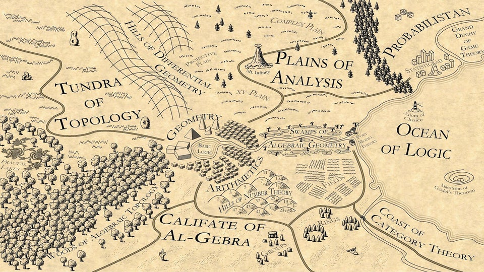
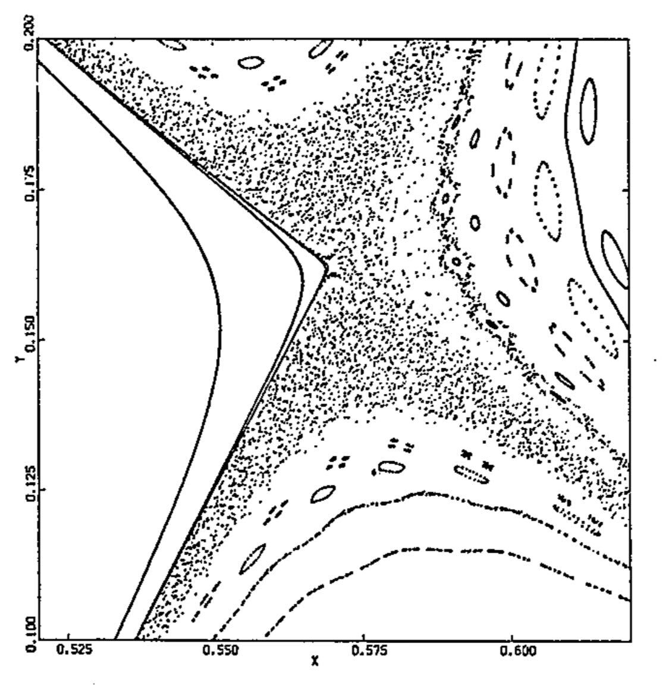
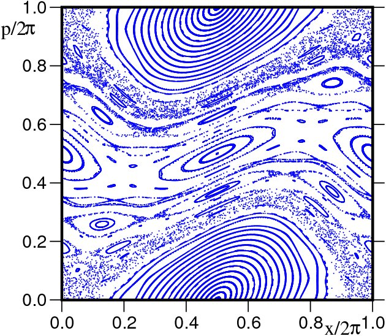
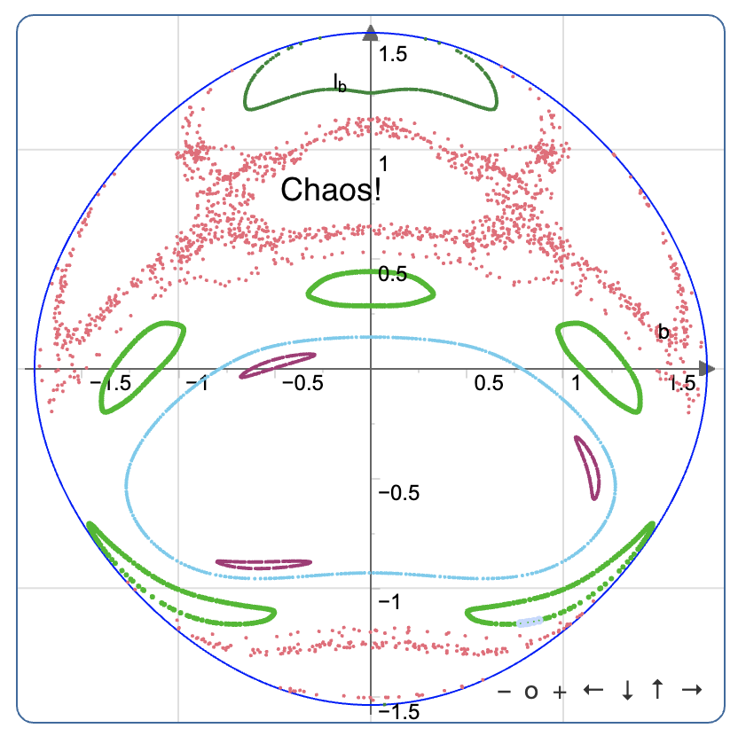
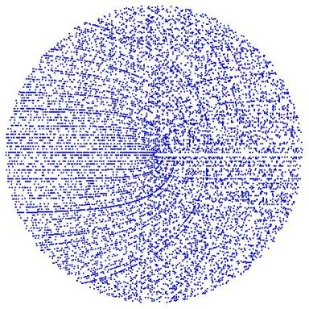

<!-- --- -->
<!-- layout: post -->
<!-- title: Turing Tarpits and Computational Conservationism -->
<!-- --- -->

There is a lot of fancy math. Historically and academically we started with arithmetic, then algebra and eventually calculus. One might be forgiven for thinking this curriculum reflects the natural difficulty of those subjects. Computationally speaking, the opposite is true -- for a computer, [calculus](https://compcalc.github.io/) is second nature, algebra is hard but can be implemented with great difficulty, and arithmetic is generally speaking, impossible.

The trouble is, mathematics takes a great deal for granted which cannot be efficiently computed. Things which appear trivial can be highly impractical or impossible to implement on a computer. This was first realized by Godel and Church, and reappears nearly everywhere, from physics to number theory, a problem which has come to be known as the [Turing Tarpit](https://en.wikipedia.org/wiki/Turing_tarpit). The theory of addition is [superexponential](https://link.springer.com/chapter/10.1007/978-3-7091-9459-1_5), but throw in multiplication and suddenly you've got yourself a Turing machine.



There are many interesting things about graphs. But there is more to graphs than meets the eye. Simple chains are mostly tractable, trees are hard enough to represent and graphs are all but impossible. Consider the space of all possible trees less than a certain height. Superexponential growth. Enumeration is barely possible. And binary trees are only a tiny fragment of possible trees, trees are only small fraction of possible graphs, and graphs are untyped. If we need to attach some information corresponding to specific edges or nodes, what hope is there?

```
BT(n+1)=(BT(n)+2)²−1

1 3 3
2 24 21
3 675 651
4 458329 457653
5 210066388899 210065930571
```

There are generative random graph processes, e.g. Erdos-Renyi, Watts Strogats, et al. -- these are examples of a more general thing known as a graph rewrite system. Graph rewriting requires efficient subgraph isomorphism and is another Turing Tarpit. How can we sample uniformly from all possible graphs? In practice, the graphs people care about are more constrained. By incrementally constructing the graph and carefully constraining the rewrite rules, it may be feasible to sample a subspace, but step off the data manifold, and here be dragons.


Consider the space of representable functions: this is program synthesis! And the data type of functions is nonlinear.

```
b^a
```

Clearly things can get out of control quickly, so what do we loose by sticking to linearity? Peano arithmetic. While possible to encode, it grows very inefficient. Most computers do not implement this correctly and true multiplication requires a nontrivial algorithm like Karatsuba or derivatives. The complexity of true multiplication is unknown.

Most computer programmers would rather ignore this and pretend computers are some exotic species of capricious genie to whom we must supplicate ourselves for answers. If we ignore the fact this genie has some idiosyncrasies, we can maintain the illusion of control. Computer programming has been carefully constructed to avoid these unpleasant scenarios. But computers do not behave rationally if we look behind the curtain.

Linearity is nice: Linear types, linear logic, linear algebra. Everybody from politicians to programmers like linear systems. We have a lot of well-behaved control theory to describe them. The sort of thing that got us to the moon and raised electromagnetic empires out of ashes and dust. But beware the nonlinear, for this is where cybernetics has little to say. And if the singulartians are to be believed, we are living in nonlinear times.

In numerical analysis, the condition number measures the sensitivity of a function...

There is believed to be a physically accessible complexity class outside NP, but beyond that, that's it Fritz. We need better ways to utilize the limited computational resources we've got. We need a kind of conservationism, a new kind of computability theory that will allow us to sustainably harvest computation. Without careful attention to asymptotics, we may end up with a runaway parasitic computation scenario like BTC.

Statistical physicists have long studied phase transitions. Nonlinear boundaries in phase space which give rise to new states of matter. We can characterize these boundaries observationally, but can we infer their properties from first principles? Even if we had no measurement error, this is surprisingly difficult.

The combination of measurement uncertainty and uncomputability are a deadly duo. This means that truth and falsehood cannot be known in general and there is a third possibility. Truth, falsehood and "..." -- the genie keeps us waiting indefinitely. Essentially, we cannot know whether it will terminate in a trillion trillion years, tomorrow, or never, we cannot even know whether we will know whether... you get the picture.

> “Set up a rack of billiard balls and execute a flawless break. Imagine the table has no pockets and is frictionless, so the balls just keep rebounding, never coming to a stop; how accurately can you predict the path of any given ball as it collides against the others? In 1978, the physicist Michael Berry calculated that you could predict only nine collisions before you would need to account for the gravitational effect of a person standing in the room. If your initial measurement of a ball’s position is off by even a nanometer, your prediction becomes useless within a matter of seconds.” -- Ted Chiang

Essentially measurement error compounds very quickly in nonlinear systems. The relative time scale which collisions take place compared to the refresh rate of most sensors is too large to overcome the rate of compounding. Maybe the Lyapunov exponent for billiards is too large to predict the dynamics beyond a few time steps ahead, even if you had access to much faster and higher resolution sensors. I wonder if the distribution of unstable trajectories is roughly uniform, or maybe there are some paths through phase space that are more stable than others. Perhaps it is possible to use simulation to discover low-entropy trajectories that lead to desirable states which are reproducible in the real world.

There is a vast chasm of computational complexity between games like billiards, Chess, Go, and protein folding, to program induction. Unlike problems where the configuration space grows exponentially, the space of valid programs is at least super-exponential and depending on the language family, (e.g. context free, context sensitive, recursively enumerable), can often be undecidable. Furthermore, many language induction problems do not have optimal substructure or overlapping subproblems, two important prerequisites for reinforcement learning to work. In these settings, gradient-based heuristics will only get you so far.

There are surprisingly tiny Boolean circuits which can be found using constraint solving, but we have not yet been able to learn despite the success of reinforcement learning in other domains (cf. TerpreT) In fact there are strange islands of stability in a sea of chaos. An unmistakable signal piercing through the noise. Gardens of Eden, stable orbits, peninsula of predictability amidst the seething abyss. Fragments of some hidden symmetry at the threshold of order and chaos.

<table align="center">
    <tr>
        <td align="center">Billards</td>
        <td align="center">Kicked Rotor</td>
    </tr>
    <tr>
        <td align="center">Double Pendula</td>
        <td align="center">Prime numbers</td>
    </tr>
</table>

Many stochastic processes exhibit some hidden structure when you look at them from a certain perspective. Projecting their dynamics onto a lower dimensional manifold with the right basis vectors reveals the mixture is heterogeneous! Look at a double pendulum. The same things can be seen: islands of stability surrounded by a great writhing sea of chaos. Can we predict the topography of those islands without visiting all its contours? Toy problems are possible to simulate using Monte Carlo. For others, galactic computation may be needed. Perhaps, if our pattern-matching faculties were sharper, their structure could be brought into focus. This visualization is called a [Poincaré map](https://en.wikipedia.org/wiki/Poincar%C3%A9_map).

Persistent homology allows us to recover the structure of higher dimensional shapes which we cannot picture. A kind of map of sorts, for lower dimensional voyagers.

Computer scientists must do away with this folly that hardware scaling will solve all our problems. There are things that scale faster than any man-made singularity (e.g., Ackermann functions, busy beavers) which lurk in jungle that encircles the Turing Tarpit. If we are to tame these behemoths, we need a theory of possible worlds, otherwise we will be devoured by the problems that lurk within.

Possible worlds are not sampled uniformly from the space of all worlds. They are carved out of nothing by sheer imagination. Things are related by different choices. There is a world where Kennedy's shooter shot and missed, or the Battle of Thermopylae went the other way. There is also a universe (in fact, infinite universes) where unimaginable things happen on a regular basis -- we will never be able to access it, because, we cannot dream it. The space of all programs human beings will ever write in the universe is finite. There is a finite branching factor and depth, of which we can only traverse a infinitely small fraction.

Ideas to explore

- possible words
- names
- sketching
- space-filling curves
- quasirandom sequences
- propagation
- sheaves

- Homotopy
- Homology
- Holonomy

The thing they don't teach you in school, is that almost all knowledge is made up. Not in the sense it is untrue, but someone dreamt of it and took the dream seriously enough to write it down. Why does it describe reality so well? Because dreams come from reality. The nice thing about computer programming is that unlike writing, your dreams can be type checked by a machine. You can make your dreams reality. Unlike dreams which fade, the end result is a program.


