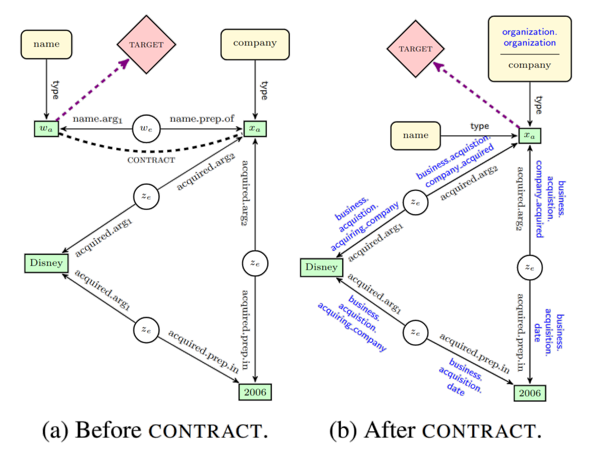
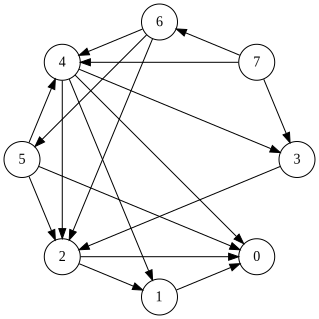
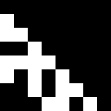
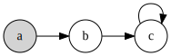
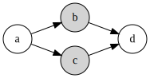
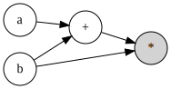

A carefully edited anthology in which I vindicate my illustrious career as a hype-chasing Hacker News junkie, AI astrologer, and Twitter fortune-teller, while debunking my critics in the peanut gallery. I also extol the virtues of graphs, algebra, types, and how these concepts can help us think about software. Finally, I share my predictions for the path ahead, which I consider to be the start of an exciting new chapter in computing history.

TLDR: Research has shown a great many algorithms can be expressed as matrix multiplication, suggesting an unrealized connection between linear algebra and computer science. I speculate that graphs are the missing piece of the puzzle. Graphs are not only useful as cognitive aides, but are suitable data structures for performing a wide variety of computation, particularly on modern parallel architectures. Finally, I propose a computational primitive based on matrix multiplication.

Disclaimer: None of these ideas are mine. Shoulders of giants.

*Note: Use landscape mode for optimal reading experience.*

# New decade, new delusions

Over the last decade, I bet on some strange ideas. A lot of people I looked up to at the time laughed at me. I'll bet they aren't laughing anymore. I ought to thank them one day, because their laughter gave me a lot of motivation. I've said some idiotic things to be sure, but I've also made some laughable predictions which were correct. Lesson learned: aim straighter.

In 2012, I was in Austin sitting next to an ex-poker player named [Amir](https://twitter.com/amirpc) who was singing Hinton's praises. Hypnotized by his technicolor slides, I quit my job in a hurry and started an educational project using speech recognition and restricted Boltzman machines. It never panned out, but I learned a lot about ASR and Android audio. Still love [that idea](http://breandan.net/2014/02/09/the-end-of-illiteracy/).

<center>
<a href="https://www.cs.toronto.edu/~hinton/csc2535/notes/lec4new.pdf"></a>
</center>

In 2016, I quit my next job as a tech evangelist to [run around the world](http://breandan.net/2016/12/27/traveling-tales/) giving incoherent talks about deep learning. Met Yoshua at the United Nations and decided to study in Canada. I applied to UofT and UdeM. Ended up at UdeM because I hate asking for recommendations, and they were the only ones who didn't care about them anyway. Best decision I ever made. Move to Montréal, thank me later.

In 2017, I started writing a book on the ethics of automation and [predicted](http://breandan.net/2017/02/02/trust-in-automation/) mass unemployment and social unrest. Although I got the causes wrong (pandemic, go figure), the information economy and bias takes were all dead right. Sadly, this is now driving the world completely insane. Don't say I warned you, go out and fix our broken systems. The world needs more engineers who care.

<center>
<a href="https://colah.github.io/posts/2015-09-NN-Types-FP/"></a>
</center>

In 2017, I witnessed the birth of differentiable programming, which I stole from Chris Olah and turned into a [master's thesis](https://github.com/breandan/kotlingrad/blob/master/latex/thesis/thesis.pdf). Had a lot of trouble convincing people that programs could be made differentiable, but look at the proceedings of any machine learning conference today and you'll find dozens of papers on differentiable sorting and rendering and simulation. Don't thank me, thank Chris and the Theano guys.

In 2018, I correctly predicted Microsoft would acquire GitHub to mine code. Why MS and not Google? I'll bet they tried, but Google's leadership had fantasies of AGI and besides JetBrains, MS were the only ones who gave a damn about developers. Now ML4SE is a thriving [research area](https://ml4se.github.io/) and showing up in [real](https://github.com/JetBrains-Research/DeepBugsPlugin) [products](https://devblogs.microsoft.com/visualstudio/ai-assisted-intellisense-for-your-teams-codebase/), much to the chagrin of those who believed ML was a fad. I suspect their hype filter blinded them to the value those tools provide. Lesson learned: focus on tools, not hype.

<center>
<blockquote class="twitter-tweet"><p lang="en" dir="ltr">Prediction: MS will acquire GH within five years. If the <a href="https://twitter.com/hashtag/ML4Code?src=hash&amp;ref_src=twsrc%5Etfw">#ML4Code</a> stuff delivers for MS, acquisition is highly likely. Although it would have been cheaper a few years ago. <a href="https://t.co/5ZMtiRtifD">https://t.co/5ZMtiRtifD</a> <a href="https://t.co/TaxkArm5ps">https://t.co/TaxkArm5ps</a></p>&mdash; breandan (@breandan) <a href="https://twitter.com/breandan/status/993553301927936001?ref_src=twsrc%5Etfw">May 7, 2018</a></blockquote> <script async src="https://platform.twitter.com/widgets.js" charset="utf-8"></script>

<a href="https://blogs.microsoft.com/blog/2018/10/26/microsoft-completes-github-acquisition/">
</a>
</center>

But to heck with everything I've said! If I had just one idea to share with these ML people, it would be types. Beat that drum as loud as I could. Types are the best tool we know for synthetic reasoning. If you want to build provably correct systems that scale on real world applications, types are the answer. Not everyone is convinced yet, but mark my words, [types](https://github.com/tensorflow/tensorflow/issues/12345) are [coming](https://docs.python.org/3.9/whatsnew/3.9.html#pep-585-builtin-generic-types). Whoever figures out how to connect types and learning will be the next Barbara Liskov or Frances Allen.

This year, I predicted the pandemic weeks before the lockdown, exited the market, and turned down a job at Google. Some people called me crazy. Now I'm going all-in on some new ideas (none of which are mine). I'm making some big bets and some will be wrong, but I see the very same spark of genius in them. Hang on to your hats, because if I'm right, these ideas are going to shake the foundations of modern computing.

# Everything old is new again

As a kid, I was given a book on the history of mathematics. I remember it had some interesting puzzles, including one with [some bridges](https://en.wikipedia.org/wiki/Seven_Bridges_of_K%C3%B6nigsberg) in a town divided by rivers, once inhabited by a man called Euler. Was there a tour crossing each bridge exactly once? Was it possible to tell without checking every path? I remember spending days trying to figure out the answer.

<center>
<a href="https://en.wikipedia.org/wiki/Seven_Bridges_of_K%C3%B6nigsberg"></a>
</center>

In the late 90s, my mom and I went to Ireland. I remember visiting Trinity College, and learning about a mathematician called [Hamilton](https://en.wikipedia.org/wiki/William_Rowan_Hamilton) who discovered a famous formula connecting algebra and geometry, and carved it onto a [bridge](https://en.wikipedia.org/wiki/Broom_Bridge). We later visited the bridge, and the tour guide pointed out the stone, which we touched for good luck. The Irish have a [thing](https://en.wikipedia.org/wiki/Poulnabrone_dolmen) for [stones](https://en.wikipedia.org/wiki/Newgrange).

<center>
<a href="http://www.kurims.kyoto-u.ac.jp/EMIS/classics/Hamilton/PRIAIcos.pdf"></a>
</center>

In 2007, I was applying to college and took the train from Boston to South Bend, Indiana, home of the Fighting Irish. Wandering about, I picked up a magazine article by a Hungarian mathematician called [Barabási](https://en.wikipedia.org/wiki/Albert-L%C3%A1szl%C3%B3_Barab%C3%A1si) then teaching at Notre Dame, who had some interesting things to say about the emergent structure of [complex networks](https://en.wikipedia.org/wiki/Complex_network). Later in 2009, while studying in Rochester, I [carpooled](../images/complex_network_seminar.png) with a [nice professor](https://avesis.medeniyet.edu.tr/hasan.guclu), and learned complex networks are found in brains, languages, social networks and many marvelous places.

<center>
<a href="https://barabasi.com/f/226.pdf"></a>
</center>

Fast forward to 2017. I was lured by the siren song of algorithmic differentiation. Olivier Breleux presented [Myia](https://github.com/mila-iqia/myia) and [Buche](https://github.com/breuleux/buche). Matt Johnson gave a talk on [Autograd](https://github.com/HIPS/autograd). I met Chris Olah in Long Beach, who gave me the idea to study [differentiable programming](https://colah.github.io/posts/2015-09-NN-Types-FP/). I stole his idea, dressed it up in Kotlin and traded it for a POPL workshop paper and later a [Master's thesis](https://github.com/breandan/kotlingrad/blob/master/latex/thesis/thesis.pdf). Our contributions were using algebra, shape inference and presenting AD as term rewriting.

<center>
<a href="https://github.com/breandan/kotlingrad#dataflow-graphs"></a>
</center>

In 2019, I joined a lab with a [nice professor](https://www.cs.mcgill.ca/~jguo/) at McGill applying knowledge graphs to software engineering. Like logical reasoning, knowledge graphs are an idea from the first wave of AI in the 1960s and 70s which have been revived and studied in light of recent progress in multi-relational graphs. I believe this is an important area of research with a lot of potential. Knowledge and traceability plays an important role in software engineering, and it's the bread-and-butter of a good IDE. The world needs better IDEs if we're ever going to untangle this mess we're in.

<center>
<a href="https://structurizr.com/"></a>
</center>

This Spring, I took a fascinating [seminar on Graph Representation Learning](https://cs.mcgill.ca/~wlh/comp766/index.html). A lot of delightful graph theory had been worked out over the preceding decade. [PageRank](https://en.wikipedia.org/wiki/PageRank) turned into power iteration. People made lots of interesting connections to linear algebra, including Weisfeiler-Lehman graph kernels, graph Laplacians and spectral graph theory. There are some elegant mathematics for representing graphs, and choosing the right representation can be very powerful. More on that later.

# What are graphs?

Graphs are general-purpose data structures used to represent a variety of data types and procedural phenomena. Unlike most languages, which are highly sequential, graphs are capable of expressing a much richer family of relations between entities. Consider the following hierarchy of data structures, all of which are graphs with increasing expressive power:

- **Sets**: datasets, multisets, posets, alphabets
- **Sequences**: Lists, strings, arrays, linear function composition
- **Trees**: [Abstract syntax](https://en.wikipedia.org/wiki/Abstract_syntax_tree), [XML](https://en.wikipedia.org/wiki/Document_Object_Model), [phylogeny](https://en.wikipedia.org/wiki/Phylogenetic_tree), [decision trees](https://en.wikipedia.org/wiki/Decision_tree)
- **DAGs**: [Git](https://eagain.net/articles/git-for-computer-scientists/), [citations](https://en.wikipedia.org/wiki/Citation_network), [dependency graphs](https://en.wikipedia.org/wiki/Dependency_graph), [workflows](https://en.wikipedia.org/wiki/Workflow_management_system), [control flow](https://en.wikipedia.org/wiki/Control-flow_graph), [MLPs](https://en.wikipedia.org/wiki/Multilayer_perceptron)
- **Directed graphs**: [State machines](https://en.wikipedia.org/wiki/Finite-state_machine), [λ-calculus](http://dkeenan.com/Lambda/), [the web](https://computersciencewiki.org/index.php/The_web_as_a_directed_graph), [call graphs](https://en.wikipedia.org/wiki/Call_graph), [RNNs](https://en.wikipedia.org/wiki/Recurrent_neural_network)
- **Hypergraphs**: [Knowledge](https://arxiv.org/pdf/2003.02320.pdf), [Zettelkasten](https://zettelkasten.de/), [categories](https://en.wikipedia.org/wiki/Category_theory), [physics](https://writings.stephenwolfram.com/2020/04/finally-we-may-have-a-path-to-the-fundamental-theory-of-physics-and-its-beautiful/), [hypernetworks](https://openreview.net/pdf?id=rkpACe1lx)

Directed graphs can be used for modeling mathematical expressions as I show in [Kotlin∇](https://github.com/breandan/kotlingrad), as well as other formal languages, including source code, intermediate representations and markup. There are many recent examples of learning directed graphs for neuro-symbolic applications:

* [Deep Learning for Symbolic Mathematics](https://arxiv.org/pdf/1912.01412.pdf), Lample and Charton, 2019.
* [Discovering Symbolic Models from Deep Learning with Inductive Biases](https://arxiv.org/pdf/2006.11287.pdf), Cranmer et al., 2020.
* [Symbolic Pregression: Discovering Physical Laws from Raw Distorted Video](https://arxiv.org/pdf/2005.11212.pdf) (Udrescu & Tegmark, 2020).
* [DreamCoder: Growing generalizable, interpretable knowledge with wake-sleep Bayesian program learning](https://arxiv.org/pdf/2006.08381.pdf), Ellis et al., 2020.

Graphs are also be found in natural language, such as [constituency](https://en.wikipedia.org/wiki/Phrase_structure_grammar), [dependency](https://en.wikipedia.org/wiki/Dependency_grammar), [link](https://en.wikipedia.org/wiki/Link_grammar) and other common grammars. Research has begun to show many practical applications for such grammars in the extraction and organization of human knowledge stored in large text corpora. Those graphs can be further processed into ontological representations for logical reasoning.

<center>

</center>

Using coreference resolution and entity alignment techniques, we can reconstruct internally consistent relations between entities, reflecting cross-corpus consensus in natural language datasets. These relationships can be stored in [knowledge graphs](https://arxiv.org/pdf/2003.02320.pdf), and used for information retrieval and question answering, e.g. on wikis and other content management systems. Recent techniques have shown promise in automatic knowledge base construction (cf. [Reddy et al.](https://www.mitpressjournals.org/doi/pdf/10.1162/tacl_a_00088), 2016).

<!-- -->
<center>

</center>

Lo and behold, the key idea behind knowledge graphs is our old friend, types. Knowledge graphs are multi-relational graphs whose nodes and edges possess a type. Two entities can be related by multiple types, and each type can relate many pairs of entities. We can index an entity based on its type for knowledge retrieval, and use types to reason about compound queries, e.g. "Which `company` has a direct `flight` from a `port city` to a `capital city`?", which would otherwise be difficult to model explicitly without a type system.

# Graphs, inductively

One thing that always fascinated me is the idea of inductively defined languages, also known as recursive, or structural induction. Consider a very simple language which accepts strings of the form `0`, `1`, `100`, `101`, `1001`, `1010`, et cetera, but rejects `011`, `110`, `1011`, or any string containing `11`. The `→` symbol indicates a "production". The `|` symbol, which we read as "or", is just a shorthand for defining multiple productions on a single line:

```
true → 1
term → 0 | 10 | ε
expr → term | expr term
```

We have two sets of productions, ones which can be expanded, called "nonterminals", and ones which can be expanded no further, called "terminals". Notice how each non-terminal occurs at most once in any single production. This property guarantees the language is recognizable by a special kind of graph, called a finite state machine. As their name indicates, FSMs contain a finite number of states, with labeled transitions between them:

|Finite State Machine | Library Courtesy Bell |
|:------:|:------:|
|<center></center>| <br/><center></center><br/>Please ring the bell **once**<br/> and wait for assistance. |

Imagine a library desk: you can wait quietly and eventually you will be served. You can ring the bell once, and wait quietly to be served. Should no one arrive after some time, you may press the bell again and continue waiting. Though you must never ring the bell twice, lest you disturb the patrons and be tossed out.

Now suppose we have a slightly more expressive language which accepts well-formed arithmetic expressions with up to two variables, in either infix or unary operator notation. In this language, a non-terminal occurs twice inside a single production -- an `<expr>` can be composed of two shorter `<expr>`s:

```
term → 1 | 0 | x | y
  op → + | - | ·
expr → term | op expr | expr op expr
```

This is known as a context-free language (CFL). We can represent strings in this language using a special kind of graph, called a syntax tree. Each time we expand an `<expr>` with a production rule, this generates a rooted subtree on `<op>`, whose branch(es) are `<expr>`s. Typically, syntax trees are inverted, with branches extending downwards and leaves on the bottom:

|Syntax Tree| Peach Tree|
|-----------|-----------|
|||
 
While syntax trees can be interpreted computationally, they do not actually perform computation until evaluated. To evaluate a syntax tree, we will need to introduce some new rules. Instead of just allowing terminals to occur on the right hand side of a grammar production, suppose we also allow terminals on the left, and applying a rule can reduce the size of a string in our language. Here, we use capital letters on the same line to indicate an exact match, e.g. a rule `U + V → V + U` would replace `x + y` with `y + x`:

```
                                         E + E → +E
                                         E · E → ·E
                  E + 1 | 1 + E | +1 | -0 | ·1 → 1
                         E + 0 | 0 + E | E - 0 → E
  E - E | E · 0 | 0 · E | 0 - E | +0 | -1 | ·0 → 0
```

This is known as a recursively enumerable language, or string rewrite system. This particular example produces directed acyclic graphs, which we can think of as grafting or pruning the branches of a tree. If we must combine two identical expressions, why evaluate them twice? If we need to multiply an expression by `0`, why evaluate it at all? Some say, "all trees are DAGs, but not all DAGs are trees". Growing up in the woods, I prefer to think of a DAG as a tree with a [gemel](https://en.wikipedia.org/wiki/Inosculation):

|Rewrite Rule|Deformed Tree|
|---|----|
|<center></center>|<br/><center></center>|
|<center></center>|<br/><br/><center></center>|

Let us now introduce a new operator, `Dₓ`, and some corresponding rules. In effect, these rules will push `Dₓ` as far towards the leaves as possible, while rewriting terms along the way. We will also introduce some terminal rewrites:

```
(R0)       term → Dₓ(term)
(R1)      Dₓ(x) → 1                  
(R2)      Dₓ(y) → 0                  
(R3)    Dₓ(U+V) → Dₓ(U) + Dₓ(V)      
(R4)    Dₓ(U·V) → U·Dₓ(V) + Dₓ(U)·V  
(R5)     Dₓ(+U) → +Dₓ(U)
(R6)     Dₓ(-U) → -Dₓ(U)
(R7)     Dₓ(·U) → +U·Dₓ(U)
(R8)      Dₓ(1) → 0
(R9)      Dₓ(0) → 0
```

Although we assign an ordering `R0`-`R9` for notational convenience,  an initial string when given to this system will always converge to the same result, no matter the order in which we perform the substitutions (proof required):

|Term Confluence|Ottawa-St. Lawrence Confluence|
|:---:|:---:|
|<br/><center></center>|<br/><center></center>|

This feature, called [confluence](https://en.wikipedia.org/wiki/Confluence_(abstract_rewriting)), is an important property of some rewrite systems: regardless of the substitution order, we will always arrive at the same result. If all strings in a language converge to a form which can be simplified no further, we call such systems *strongly normalizing*.

Just like grammars, we can define graphs themselves inductively. As many graph algorithms are recursive, this choice considerably simplifies their implementation. Take one definition for an unlabeled directed graph, proposed by [Erwig](https://web.engr.oregonstate.edu/~erwig/papers/InductiveGraphs_JFP01.pdf) (2001). Here, the notation `list → [item]` is a shorthand for `list → item list`, where `item` is some terminal, and `list` is just a list of `item`s:

```
vertex  → int
adj     → [vertex]
context → (adj, vertex, adj)
graph   → empty | context & graph
```

He defines a `graph` in four parts. First, we have a `vertex`, which is simply an integer. Next we have a list of vertices, `adj`, called an adjacency list. The `context` is a 3-tuple containing a `vertex` and symmetric references to its inbound and outbound neighbors, respectively. Finally, the inductive case: a `graph` is either (1) `empty`, or (2) a `context` and a `graph`.

Let us consider a simple graph implementation in Kotlin. We do not record inbound neighbors, and attempt to define a vertex as a [closed neighborhood](https://en.wikipedia.org/wiki/Neighbourhood_(graph_theory)):

```kotlin
open class Graph(val vertices: Set<Vertex>) { ... }
data class Vertex(neighbors: Set<Vertex>): Graph(this + neighbors)
//                                               ↳ Compile error!
```

Note the coinductive definition, which creates problems right off the bat. Since `this` is not accessible inside the constructor, we cannot have cycles or closed neighborhoods. Maybe we can come up with a definition which allows cycles and closed neighborhoods by avoiding coinduction:

```kotlin
class Graph(val vertices: Set<Vertex>) { ... }
class Vertex(val neighbors: Set<Vertex>)
```

Already, this definition admits a nice k-nearest neighbors implementation:

```kotlin
tailrec fun Vertex.neighbors(k: Int = 0, vertices: Set<Vertex> =
                             neighbors + this): Set<Vertex> =
  if (k == 0 || vertices.neighbors() == vertices) vertices
  else knn(k - 1, vertices + vertices.neighbors() + this)

fun Set<Vertex>.neighbors() = flatMap { it.neighbors() }.toSet()

// Removes all vertices outside the set
fun Set<Vertex>.closure() = map { vertex ->
  Vertex(neighbors.filter { it in this@closure })
}.toSet()

fun Vertex.neighborhood(k: Int = 0) = Graph(neighbors(k).closure())
```

But what about cycles? To support cycles, we will need to modify our definition slightly, to delay edge creation until after construction:

```kotlin
class Graph(val vertices: Set<Vertex>) { ... }
class Vertex(map: (Vertex) -> Set<Vertex>) {
    val neighbors = map(this).toSet()
}
```

We can now call `Vertex() { setOf(it) }` to create a vertex with a self-loop.

Let us consider an algorithm called the Weisfeiler-Lehman isomorphism test, which my colleague David Bieber wrote a [nice piece](https://davidbieber.com/post/2019-05-10-weisfeiler-lehman-isomorphism-test/) about. I'll focus on the implementation. First, we need a pooling operator, which will aggregate all neighbors in our neighborhood using some summary statistic:

```kotlin
fun Graph.poolBy(stat: Set<Vertex>.() -> Int): Map<Vertex, Int> =
  nodes.map { it to stat(it.neighbors()) }.toMap()
```

Next, we'll need a histogram, which counts each node's neighborhood:

```kotlin
val histogram: Map<Vertex, Int> by lazy { poolBy { size } }
```

Now we're ready to define the [Weisfeiler-Lehman operator](http://www.jmlr.org/papers/volume12/shervashidze11a/shervashidze11a.pdf#page=6), which recursively computes a hash on the histogram for `k` rounds.

```kotlin
tailrec fun wl(k: Int, labels: Map<Vertex, Int>): Map<Vertex, Int> =
  if (k <= 0) labels
  else wl(k - 1, poolBy { map { labels[it]!! }.sorted().hashCode() })
```

We compute the hash hashcode of the entire graph by hashing the multiset of WL labels. With one round, we're just comparing the degree historgram. The more rounds we add, the more likely we are to detect a symmetry breaking hashcode:

```kotlin
override fun Graph.hashCode(rounds: Int = 10) = 
    wl(rounds, histogram).values.sorted().hashCode()
```

Now we can define a test to detect if one graph is isomorphic to another:

```kotlin
fun Graph.isIsomorphicTo(that: Graph) =
  this.nodes.size == that.nodes.size && 
  this.numOfEdges == that.numOfEdges && 
  this.hashCode() == that.hashCode()
```

Now we're done. This algorithm works on almost every graph you will ever encounter. That was easy! For a complete implementation, refer to [this repository](https://github.com/breandan/kaliningraph).

TODO: Graph grammars are grammars on graphs.

TODO: Single/Double pushout

# Graphs, visually

Consider the [elementary cellular automata](https://en.wikipedia.org/wiki/Elementary_cellular_automaton), which consists of a one dimensional array, and a 3-cell rewrite grammar. There are 2<sup>2<sup>3</sup></sup>=256 rules for rewriting the tape. It turns out even in this simple space, there are remarkable automata. Consider the following rewrite system, which can be represented graphically:

<center>

</center>

<!---->

<!--We can represent this using graphs:-->

<!---->


<!--| current pattern           | `111` | `110` | `101` | `100` | `011` | `010` | `001` | `000` |-->
<!--|:-------------------------:|:---:|:---:|:---:|:---:|:---:|:---:|:---:|:----:|-->
<!--| new pattern | ` 0 `  | ` 1 `  | ` 1 `  | ` 0 `  | ` 1 ` | ` 1 `  | ` 1 `  | ` 0 `  |-->


This system is equivalent to a [Turing machine](https://wpmedia.wolfram.com/uploads/sites/13/2018/02/15-1-1.pdf). Consider the λ-calculus, another Turing complete system. It consists of the following rules:

```
<expr>   → <name> | <func> | <appl>
<func>   → λ <name>.<expr>
<appl>   → <expr><expr>
λx.M[x]  → λy.M[y]    (α-conversion)
(λx.M) E → M[x := E]  (β-reduction)
```

The λ-calculus can also be represented graphically. I refer the gentle reader to these proposals:

* [Graphic lambda calculus](https://arxiv.org/pdf/1305.5786.pdf)
* [Visual lambda calculus](http://bntr.planet.ee/lambda/work/visual_lambda.pdf)
* [To Dissect a Mockingbird: A Graphical Notation for the Lambda Calculus](http://dkeenan.com/Lambda/)

Graphs have also found many interesting applications as reasoning devices in various domains:

|Diagramming Language|Example|
|:--:|:-----:|
|[Feynman diagram](http://www-pnp.physics.ox.ac.uk/~barra/teaching/feynman.pdf)|<br/><center></center>|
| [Category theory](https://www.cs.mcgill.ca/~prakash/Pubs/category_theory_notes.pdf) |<br/><center></center>|
| [Penrose notation](https://www.mscs.dal.ca/%7Eselinger/papers/graphical-bib/public/Penrose-applications-of-negative-dimensional-tensors.pdf) |<br/><center></center>|
|  [Tensor network notation](https://www.mscs.dal.ca/%7Eselinger/papers/graphical-bib/public/Penrose-applications-of-negative-dimensional-tensors.pdf) | <br/><center></center>|
| [Finite state machines](https://en.wikipedia.org/wiki/Finite-state_machine) | <br/><center></center> |
| [Petri networks](https://en.wikipedia.org/wiki/Petri_net) | <br/><center></center> |
| [Proof networks](https://en.wikipedia.org/wiki/Proof_net) | <br/><center></center> |

As Tae Danae Bradley [vividly portrays](https://www.math3ma.com/blog/matrices-probability-graphs), matrices are not just 2D arrays, matrices are *functions on vector spaces*. This has a nice visual representation using a bipartite graph:

<center>
<a href="https://www.math3ma.com/blog/matrices-probability-graphs"></a>
</center>

Not only do matrices correspond to graphs, graphs also correspond to matrices. One way to think of a graph is just a boolean matrix, or real matrix for weighted graphs. Consider an adjacency matrix containing nodes V, and edges E, where:

$$
\begin{align*}
\mathbf A \in \mathbb B^{|V|\times|V|} \text{ where } \mathbf A[u, v] =
    \begin{cases}
       1,& \text{if } u, v \in E \\
       0,& \text{otherwise}
    \end{cases}
\end{align*}
$$

Just like matrices, we can also think of a graph as a function which carries information from state to state - given a state, it tells us which next states are accessible. This correspondence suggests an unrealized connection between graph theory and linear algebra which is still being explored, and promises important applications for signal processing on graphs.

|Geometric | Matrix |
|:------:|:-------:|
|||

Note the lower triangular structure of this matrix, indicating there are no cycles, a property which is not immediately obvious from the naïve geometric layout. Iff the vertices of a directed graph can be reordered to produce an adjacency matrix in triangular form, this graph is said to be a directed acyclic graph. Commonly encountered in introductory CS classes, this ordering, called a topological ordering, can also be implemented using [matrix multiplication](https://en.wikipedia.org/wiki/Topological_sorting#Parallel_algorithms) on the adjacency matrix.

Both geometric and matrix representations impose a extrinsic perspective on graphs, each with its own advantages and disadvantages. 2D renderings can be visually compelling, but require solving a [minimal crossing number](https://en.wikipedia.org/wiki/Crossing_number_(graph_theory)) or similar minimization to make network connectivity plain to the naked eye. While graph drawing is an active [field of research](http://www.graphdrawing.org/), matrices can often reveal symmetries that are not obvious from a naive graph layout.

Matrices are problematic for other reasons. Primarily, by treating a graph as a matrix, we impose an ordering over all vertices which is often arbitrary. Note also its sparsity, and consider the size of the matrix required to store even small graphs. While problematic, this can be overcome with certain optimizations. Despite their disadvantages, matrices and are a natural representation choice for many graph algorithms, particularly on modern parallel processing hardware. More on that later.

# Graphs, computationally

What happens if we define arithmetic operators on graphs? How could we define and interpret these operations in a meaningful way? As we have seen, one way to represent a directed graph is just a square matrix whose non-zero entries indicate edges between nodes. Just like real matrices in linear algebra, we can add, subtract, multiply and exponentiate them.

One interesting game mathematicians like to play, is to design a square matrix ℝ<sup>K×K</sup> and raise it to a power. There are various tricks for designing the matrix and normalizing the product so it does not explode or vanish. If we then multiply the matrix by a state vector ℝ<sup>K</sup>, we are effectively "simulating" the system at discrete time steps. This game has many important applications in control theory, dynamical systems and deep learning (RNNs).

We can think about this as either a matrix product (MM...M)V, or function application M(M(...M(V)...)), where M is a function on a vector space (these two views are equivalent). There are various names for M, such as the transition matrix, stochastic matrix, or Markov matrix. It turns out the very same idea is not just valid over real matrices, but can be generalized to boolean and integer matrices. We are primarily interested in the deterministic version, whose variables inhabit 𝔹<sup>K×K</sup>.

It turns out that power iteration of a square matrix converges to its the eigenvector. This has important consequences for dynamical systems on networks. Researchers are just beginning to understand how eigenvalues of the adjacency matrix govern long timescale dynamical processes on graphs. In this section, we will explore some examples of dynamical processes on graphs.

We have previously seen an example of graph computation, Weisfeiler-Lehman, and topsort. Three steps of Barabási's preferential attachment algorithm:

|DOT Graph|Matrix|
|:-------:|:----:|
|<center></center>|<center></center>|
|<center></center>|<center></center>|
|<center></center>|<center></center>|

Another early example of graph computation can be found in [Valiant](http://theory.stanford.edu/~virgi/cs367/papers/valiantcfg.pdf) (1975):

<center>
<blockquote class="twitter-tweet"><p lang="en" dir="ltr">TIL: CFL parsing can be reduced to boolean matrix multiplication (Valiant, 1975), known to be subcubic (Strassen, 1969), and later proven an asymptotic lower bound (Lee, 1997). This admits efficient GPGPU implementation (Azimov, 2017) in <a href="https://twitter.com/YaccConstructor?ref_src=twsrc%5Etfw">@YaccConstructor</a> <a href="https://t.co/3Vbml0v6b9">https://t.co/3Vbml0v6b9</a></p>&mdash; breandan (@breandan) <a href="https://twitter.com/breandan/status/1277136195118600192?ref_src=twsrc%5Etfw">June 28, 2020</a></blockquote> <script async src="https://platform.twitter.com/widgets.js" charset="utf-8"></script>
</center>

This astonishing result suggests that, at least for the context free languages, there is a parsing algorithm which is equivalent to matrix multiplication. Suppose we want to simulate an automata. All of these automata can be evolved using matrix multiplication:

- Pushdown automata
- Buchi automata
- Pushdown automata
- Petri nets

We now attempt to show a few examples simulating a state machine using matrix multiplication. For illustrative purposes, the state simply holds a vector of binary or integer values, however we can also imagine it carrying other "messages" around the graph in a similar manner, using their corresponding algebras. Here, we will use the boolean algebra, for multiplication:

## Linear chains

To get started, let's simply iterate through a linked list. We initialize the pointer to the head of the list, and each matmul advances the pointer by a single element. We add an implicit self loop to the final element, and halt whenever we detect a fixpoint.

<table>
<tr>
<td> <b>Graph</b> </td> <td> <b>Matrix</b> </td> <td> <b>S</b> </td><td> <b>S'</b> </td>
</tr>
<tr>
<td>

<div markdown="1">
<center></center>
</div>

</td>
<td>
<div markdown="1">
```
    a  b  c
   ________
a | 0  0  0
b | 1  0  0
c | 0  1  1
```
</div>
</td>
<td>
<div markdown="1">
```


1
0
0

```
</div>
</td>
<td>
<div markdown="1">
```


0
1
0

```
</div>
</td>
</tr>
<tr>
<td> 
<div markdown="1">
<center></center>
</div>
</td>
<td>
<div markdown="1">
```
    a  b  c
   ________
a | 0  0  0
b | 1  0  0
c | 0  1  1

```
</div>
</td>
<td>
<div markdown="1">
```


0
1
0

```
</div>
</td>
<td>
<div markdown="1">
```


0
0
1

```
</div>
</td>
</tr>
<tr>
<td> 
<div markdown="1">
<center></center>
</div>
</td>
<td>
<div markdown="1">
```
    a  b  c
   ________
a | 0  0  0
b | 1  0  0
c | 0  1  1

```
</div>
</td>
<td>
<div markdown="1">
```


0
0
1

```
</div>
</td>
<td>
<div markdown="1">
```


0
0
1

```
</div>
</td>
</tr>
</table>

## Directed acyclic graphs

Simulating a DFA using a matrix is wasteful, since we only ever inhabit one state at a time. The real benefit of using matrices comes in when simulating nondeterminstic finite automata (NFA). Typical implementations require cloning the NFA when multiple transitions are valid. Instead of cloning the machine, we can simulate the superposition of all states using a single matrix.

<table>
<tr>
<td> <b>Graph</b> </td> <td> <b>Matrix</b> </td> <td> <b>S</b> </td><td> <b>S'</b> </td>
</tr>
<tr>
<td> 
<div markdown="1">
<center></center>
</div>
</td>
<td>
<div markdown="1">
```
    a  b  c  d
   ___________
a | 0  0  0  0
b | 1  0  0  0
c | 1  0  0  0
d | 0  1  1  1

```
</div>
</td>
<td>
<div markdown="1">
```


1
0
0
0

```
</div>
</td>
<td>
<div markdown="1">
```


0
1
1
0

```
</div>
</td>
</tr>
<tr>
<td> 
<div markdown="1">
<center></center>
</div>
</td>
<td>
<div markdown="1">
```
    a  b  c  d
   ___________
a | 0  0  0  0
b | 1  0  0  0
c | 1  0  0  0
d | 0  1  1  1

```
</div>
</td>
<td>
<div markdown="1">
```


0
1
1
0

```
</div>
</td>
<td>
<div markdown="1">
```


0
0
0
1

```
</div>
</td>
</tr>
<tr>
<td> 
<div markdown="1">
<center></center>
</div>
</td>
<td>
<div markdown="1">
```
    a  b  c  d
   ___________
a | 0  0  0  0
b | 1  0  0  0
c | 1  0  0  0
d | 0  1  1  1

```
</div>
</td>
<td>
<div markdown="1">
```


0
0
0
1

```
</div>
</td>
<td>
<div markdown="1">
```


0
0
0
1

```
</div>
</td>
</tr>

</table>

We encode the accept state as a self cycle in order to detect the fixpoint S = MS = MMS, after which we halt execution.

## Dataflow graphs

Suppose we have the function `f(a, b) = (a + b) * b` and want to compute `f(2, 3)`. For operator indices, we will need two tricks. First, all operators will retain their state, i.e. `1`s along all operator diagonals. Second, when applying the operator, we will combine values using the operator instead of performing a sum.

<table>
<tr>
<td> <b>Graph</b> </td> <td> <b>Matrix</b> </td> <td> <b>S</b> </td><td> <b>S'</b> </td>
</tr>
<tr>
<td> 
<div markdown="1">
<center></center>
</div>
</td>
<td>
<div markdown="1">
```
    a  b  +  *
   ___________
a | 0  0  0  0
b | 0  0  0  0
+ | 1  1  1  0
* | 0  1  1  1

```
</div>
</td>
<td>
<div markdown="1">
```


2
3
0
0

```
</div>
</td>
<td>
<div markdown="1">
```


0
0
5
3

```
</div>
</td>
</tr>
<tr>
<td> 
<div markdown="1">
<center></center>
</div>
</td>
<td>
<div markdown="1">
```
    a  b  +  *
   ___________
a | 0  0  0  0
b | 0  0  0  0
+ | 1  1  1  0
* | 0  1  1  1

```
</div>
</td>
<td>
<div markdown="1">
```


0
0
5
3

```
</div>
</td>
<td>
<div markdown="1">
```


0
0
0
15

```
</div>
</td>
</tr>
<tr>
<td> 
<div markdown="1">
<center></center>
</div>
</td>
<td>
<div markdown="1">
```
    a  b  +  *
   ___________
a | 0  0  0  0
b | 0  0  0  0
+ | 1  1  1  0
* | 0  1  1  1

```
</div>
</td>
<td>
<div markdown="1">
```


0
0
0
15

```
</div>
</td>
<td>
<div markdown="1">
```


0
0
0
15

```
</div>
</td>
</tr>

</table>

# Graphs, efficiently

One issue with efficient representation of graphs is space complexity. Suppose we have a graph with 10<sup>5</sup>=100,000 nodes, but only a single edge. We will need 10<sup>5*2</sup> bits, or about 1 GB to store it in adjacency matrix form, whereas if we use an adjacency list, we will need only ⌈ 2\*log<sub>2</sub>10<sup>5</sup> ⌉ = 34 bits. Most graphs are similarly sparse. But how do you multiply adjacency lists? Unclear. The solution is to use sparse matrices. That was easy.

Another, thornier, problem with graph algorithms is their time complexity. Many interesting problems on graphs are NP-complete, including Hamiltonian paths and subgraph isomorphism. If so, how are we supposed to do any computation if every operation may take nondeterminstic polynomial time? Computer science people are mostly concerned with worst case complexity, which rarely ever occurs in practice. Real world isomorphism can be solved quickly using approximate algorithms, such as the one we saw earlier.

One issue with computation graphs is that in most programming languages, they are not reified. That is, for a given value, we would like some method which programmatically returned its provenance, as a computation graph. Which we can encode that program as a graph.

<center><blockquote class="twitter-tweet"><p lang="en" dir="ltr">Prediction: In 20 years, most of today&#39;s ISAs (x86, ARM, MIPS) will be virtual or obsolete. Underneath the hood, everything will be sparse matmuls running on a homogeneous silicon mesh. Physical CPUs will be like gasoline engines - marvels of engineering, but far too complicated.</p>&mdash; breandan (@breandan) <a href="https://twitter.com/breandan/status/1278139598942679041?ref_src=twsrc%5Etfw">July 1, 2020</a></blockquote> <script async src="https://platform.twitter.com/widgets.js" charset="utf-8"></script></center>

A lot of the stuff in Graph Representation Learning is motivated by computational constraints. You can't instantiate the adjacency matrix, because it's too large, so you need all kinds of mathematical tricks to sum over or approximate it. But most graphs are sparse and have all kinds of symmetries. Finding the right graph embedding can get you real far...

# Programs as graphs

It turns out graphs are not only useful as data structures, but we can think of the computation itself as a graph on a binary state space. Each tick of the clock corresponds to one matrix multiplication on a boolean tape.

[Futamura](https://repository.kulib.kyoto-u.ac.jp/dspace/bitstream/2433/103401/1/0482-14.pdf) (1983) shows us that programs can be decomposed into two inputs, static and dynamic. As a function mapping of inputs to output:

$$
P: I_{\text{static}} \times I_{\text{dynamic}} \rightarrow O
$$

Consider the static case, in which we have all the information available at compile time, we just need to multiply the state P: 𝔹<sup>|S|×|S|</sup> by the vector S until termination:

```
    [P]--------------------------------           } Program
      \          \          \          \
[S₀]---*---[S₁]---*---[S₂]---*---[..]---*---[Sₜ]  } TM tape
```


Now the dynamic case, P might be governed by another program:

```
        [Q]---------------------                  } Dynamics
          \          \          \
    [P₀]---*---[P₁]---*---[..]---*---[Pₜ₋₁]       } Program
      \          \          \          \
[S₀]---*---[S₁]---*---[S₂]---*---[..]---*---[Sₜ]  } TM tape
```

We might also imagine these inputs as being generated by higher order programs.

```
                     ⋮
            [R₀]---------                         } World model
              \          \
        [Q₀]---*---[..]---*---[Pₜ₋₂]              } Dynamics
          \          \          \
    [P₀]---*---[P₁]---*---[..]---*---[Pₜ₋₁]       } Program
       \         \          \           \
[S₀]---*---[S₁]---*---[S₂]---*---[...]---*---[Sₜ] } TM tape
```

What about programs of varying length? It may be the case we want to learn programs where t varies. The key is, we can choose an upper bound on t, and search for a fixpoint. That is, we halt whenever S<sub>t</sub> = S<sub>t+1</sub>.

There will always be some program, at the interface of the machine and the real world, which must be approximated. One question worth asking is how large does k need to be in order to do so? If it is very large, this procedure might well be intractable. Time complexity appears to be at least O(tk<sup>2</sup>), using Strassen.

# Program synthesis

Many people have asked me, "Why should developers care about automatic differentiation?" Yes, we can use it for building machine learning systems. Yes, it has specialized applications in robotics and physical simulation. But does it really matter for software engineers?

I have been thinking carefully about this question, and although it is not clear to me yet, I am starting to see how some pieces fit together. A more complete picture will require a lot more research, engineering and rethinking the role of software, compilers and machine learning.

```
    [P]--------------------------------           } Program
      \          \          \          \
[S₀]---*---[S₁]---*---[S₂]---*---[..]---*---[Sₜ]  } TM tape
```

Consider the static case seen above. Since the matrix P is fixed throughout execution, to learn P, we need to solve the following minimization problem:

$$
\underset{P}{\text{argmin}}\sum_{i \sim I_{static}}\mathcal L(P^t S^i_0, S_t)
$$

One issue with this formulation is we must rely on a loss function over S<sub>t</sub>, which is often too sparse and generalizes poorly. It may be the case that many interesting program synthesis problems have optimal substructure, so we should be making "progress" towards a goal state, and can define a loss over intermediate states. This needs to be explored in more depth.

Some, including [Gaunt et al.](https://arxiv.org/pdf/1608.04428.pdf) (2016), have shown gradient is not very effective, as the space of boolean circuits is littered with islands which have zero gradient. Their representation is also relative complex -- effectively, they are trying to learn a recursively enumerable language using something like a [Neural Turing Machine](https://arxiv.org/pdf/1410.5401.pdf) (Graves et al., 2014).

More recent work, including that of [Lample et al.](https://arxiv.org/pdf/1912.01412.pdf) (2019), have demonstrated Transformers are capable of learning programs, where the program belongs to a much simpler class of context free languages. This space is often much more tractable to search and generate synthetic training data, and appears to be well within the reach of modern language models.


In the last year, a number of interesting reults in differentiable architecture search started to emerge. [DARTS](https://arxiv.org/pdf/1806.09055.pdf) (Liu et al., 2019) proposes to use directly use gradient to search through the space of directed graphs. The authors first perform a continuous relaxation of the discrete graph, by reweighting the output of each each potential value by a hyperparameter, optimizing over the space of operations, then discretizing the output graph.

[](https://youtu.be/rwBbYhOAnPo?t=28272)

Solar-Lezma calls this latter approach, "program extraction", where the network implicitly or explicitly parameterizes the function, which after training, can be decoded into a symbolic expression. This also aligns with Goodfellow's notion of deep networks as programs, where each step performs a certain "step" of computation.

<center>
<blockquote class="twitter-tweet"><p lang="en" dir="ltr">&quot;Can neural networks be made to reason?&quot; Conversation with Ian Goodfellow (<a href="https://twitter.com/goodfellow_ian?ref_src=twsrc%5Etfw">@goodfellow_ian</a>). Full version: <a href="https://t.co/3MYC8jWjwl">https://t.co/3MYC8jWjwl</a> <a href="https://t.co/tGcDwgZPA1">pic.twitter.com/tGcDwgZPA1</a></p>&mdash; Lex Fridman (@lexfridman) <a href="https://twitter.com/lexfridman/status/1130501145548513280?ref_src=twsrc%5Etfw">May 20, 2019</a></blockquote> <script async src="https://platform.twitter.com/widgets.js" charset="utf-8"></script> 
</center>

A less charitable interpretation is that Goodfellow is simply using an metaphor to explain deep learning to lay audience, but I prefer to think he is communicating something important about the value of thinking about stacked nonlinear function approximators as computational primitives in a chain of function compositions.

# References

- [GRL Notes](https://cs.mcgill.ca/~wlh/comp766/notes.html)
- [Term Rewriting and All That](https://doi.org/10.1017/CBO9781139172752)
- [Representation of Events in Nerve Nets and Finite Automata](https://www.rand.org/content/dam/rand/pubs/research_memoranda/2008/RM704.pdf)
- [A Class of Models with the Potential to Represent Fundamental Physics](https://www.wolframphysics.org/technical-introduction/)