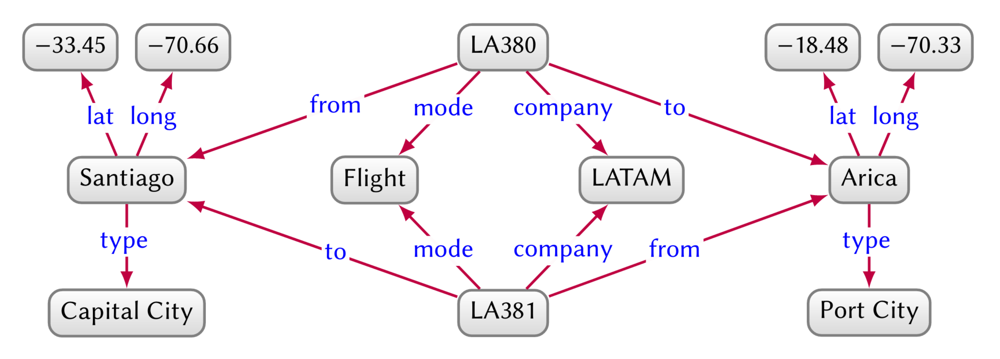
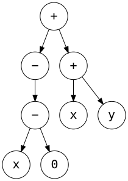
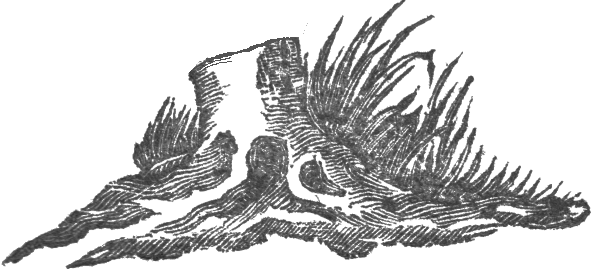
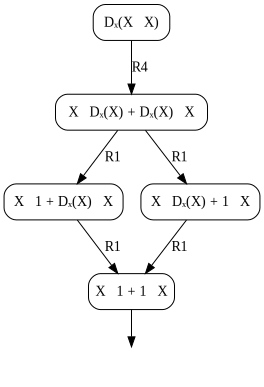
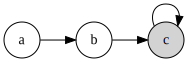

A carefully edited anthology in which I vindicate my illustrious career as a hype-chasing Hacker News junkie, AI astrologer, and Twitter prognosticator, while debunking my critics in the peanut gallery. I also extoll the virtues of graphs, algebra, types, and the value of these concepts for human-computer interaction. Finally, I share my predictions for the path ahead, which I believe to be the start of an exciting new chapter in the history of computing.

# New decade, new delusions

Over the last decade, I bet on some strange ideas. A lot of people I looked up to at the time laughed at me. I'll bet they aren't laughing anymore. I ought to thank them one day, because their laughter gave me a lot of motivation. I've said some idiotic things to be sure, but I've also made some laughable predictions which turned out correct. Lesson learned: aim straighter.

In 2012, I was in Austin sitting next to an ex-poker player named [Amir](https://twitter.com/amirpc) who was singing Hinton's praises. I poured over his technicolor slides and something must have clicked, because I quit my job in a hurry and launched an educational project using speech recognition and restricted Boltzman machines. It never panned out, but I learned a lot about ASR and Android audio. Still love [that idea](http://breandan.net/2014/02/09/the-end-of-illiteracy/).

<center>
<a href="https://www.cs.toronto.edu/~hinton/csc2535/notes/lec4new.pdf"></a>
</center>

In 2016, I quit my next job as a tech evangelist to [run around the world](http://breandan.net/2016/12/27/traveling-tales/) giving incoherent talks about deep learning. Met Yoshua at the United Nations and decided to study in Canada. I applied to UofT and UdeM. Ended up at UdeM because I hate asking for recommendations, and they were the only ones who didn't care about them anyway. Best decision I ever made. Move to Montréal, thank me later.

In 2017, I started writing a book on the ethics of automation and [predicted](http://breandan.net/2017/02/02/trust-in-automation/) mass unemployment and social unrest. Although I got the causes wrong (pandemic, go figure), the information economy and bias takes were all dead right. Sadly, this is now driving the world completely insane. Don't say I warned you, go out and fix our broken systems. The world needs more engineers who care.

<center>
<a href="https://colah.github.io/posts/2015-09-NN-Types-FP/"></a>
</center>

In 2017, I witnessed the birth of differentiable programming, which I stole from Chris Olah and turned into a [master's thesis](https://github.com/breandan/kotlingrad/blob/master/latex/thesis/thesis.pdf). Had a lot of trouble convincing people that programs could be made differentiable, but look at the proceedings of any machine learning conference today and you'll find dozens of papers on differentiable sorting and rendering and simulation. Don't thank me, thank Chris and the Theano guys.

In 2018, I correctly predicted Microsoft would acquire GitHub to mine code. Why MS and not Google? I'll bet they tried, but Google's leadership had fantasies of AGI and besides JetBrains, MS were the only ones who gave a damn about developers. Now ML4SE is a thriving [research area](https://ml4se.github.io/) and showing up in [real](https://github.com/JetBrains-Research/DeepBugsPlugin) [products](https://devblogs.microsoft.com/visualstudio/ai-assisted-intellisense-for-your-teams-codebase/), much to the chagrin of those who believed ML was a fad. I suspect their hype filter blinded them to the value those tools provide. Lesson learned: focus on tools, not hype.

<center>
<blockquote class="twitter-tweet"><p lang="en" dir="ltr">Prediction: MS will acquire GH within five years. If the <a href="https://twitter.com/hashtag/ML4Code?src=hash&amp;ref_src=twsrc%5Etfw">#ML4Code</a> stuff delivers for MS, acquisition is highly likely. Although it would have been cheaper a few years ago. <a href="https://t.co/5ZMtiRtifD">https://t.co/5ZMtiRtifD</a> <a href="https://t.co/TaxkArm5ps">https://t.co/TaxkArm5ps</a></p>&mdash; breandan (@breandan) <a href="https://twitter.com/breandan/status/993553301927936001?ref_src=twsrc%5Etfw">May 7, 2018</a></blockquote> <script async src="https://platform.twitter.com/widgets.js" charset="utf-8"></script>

<a href="https://blogs.microsoft.com/blog/2018/10/26/microsoft-completes-github-acquisition/">
</a>
</center>

But to heck with everything I've said! If I had just one idea to share with these ML people, it would be types. Beat that drum as loud as I could. Types are the best tool we know for synthetic reasoning. If you want to build provably correct systems that scale on real world applications, types are the answer. Not everyone is convinced yet, but mark my words, [types](https://github.com/tensorflow/tensorflow/issues/12345) are [coming](https://docs.python.org/3.9/whatsnew/3.9.html#pep-585-builtin-generic-types). Whoever figures out how to connect types and learning will be the next Barbara Liskov or Frances Allen.

This year, I predicted the pandemic weeks before the lockdown, exited the market, and turned down a job at Google. Some people called me crazy. Now I'm going all-in on some new ideas (none of which are mine). I'm making some big bets and some will be wrong, but I see the very same spark of genius in them. Hang on to your hats, because if I'm right, these ideas are going to shake the foundations of modern computing.

# Everything old is new again

As a kid, I was given a book on the history of mathematics. I remember it had some interesting puzzles, including one with [some bridges](https://en.wikipedia.org/wiki/Seven_Bridges_of_K%C3%B6nigsberg) in a town divided by rivers, inhabited by a man called Euler. Which towns had a path crossing each bridge exactly once? Was it possible to tell without checking every path? I remember spending days trying to figure out the answer.

<center>
<a href="https://en.wikipedia.org/wiki/Seven_Bridges_of_K%C3%B6nigsberg"></a>
</center>

In the late 90s, my mom and I went to Ireland. I remember visiting Trinity College, and learning about a mathematician called [Hamilton](https://en.wikipedia.org/wiki/William_Rowan_Hamilton) who discovered a famous formula connecting algebra and geometry, and carved it onto a [bridge](https://en.wikipedia.org/wiki/Broom_Bridge). We later visited the bridge, and the tour guide pointed out the stone, which we touched for good luck. The Irish have a [thing](https://en.wikipedia.org/wiki/Poulnabrone_dolmen) for [stones](https://en.wikipedia.org/wiki/Newgrange).

<center>
<a href="http://www.kurims.kyoto-u.ac.jp/EMIS/classics/Hamilton/PRIAIcos.pdf"></a>
</center>

In 2007, I was applying to college and took the train from Boston to South Bend, Indiana, home of the Fighting Irish. Wandering about, I found a magazine article by a Hungarian mathematician called [Barabási](https://en.wikipedia.org/wiki/Albert-L%C3%A1szl%C3%B3_Barab%C3%A1si) who had some interesting things to say about "[complex networks](https://en.wikipedia.org/wiki/Complex_network)". Later in 2009, while studying in Rochester, I [carpooled](../images/complex_network_seminar.png) with a [nice professor](https://avesis.medeniyet.edu.tr/hasan.guclu), and learned complex networks are found in brains, languages, social networks and many marvelous places.

<center>
<a href="https://barabasi.com/f/226.pdf"></a>
</center>

Fast forward to 2017. I was lured by the siren song of algorithmic differentiation. Olivier Breleux presented [Myia](https://github.com/mila-iqia/myia) and [Buche](https://github.com/breuleux/buche). Matt Johnson gave a talk on [Autograd](https://github.com/HIPS/autograd). I met Chris Olah in Long Beach, who gave me the idea to study [differentiable programming](https://colah.github.io/posts/2015-09-NN-Types-FP/). I stole his idea, dressed it up in Kotlin and traded it for a POPL workshop paper and later a [Master's thesis](https://github.com/breandan/kotlingrad/blob/master/latex/thesis/thesis.pdf). Our contributions were using algebra, shape inference and presenting AD as term rewriting.

<center>
<a href="https://github.com/breandan/kotlingrad#dataflow-graphs"></a>
</center>

In 2019, I joined a lab with a [nice professor](https://www.cs.mcgill.ca/~jguo/) at McGill applying knowledge graphs to software engineering. Like types, knowledge graphs are an idea from the first wave of AI in the 1960s and 70s which have been revived and studied in light of recent progress in representation learning on graphs. I believe this is an important area of research with a lot of potential. Knowledge and traceability plays an important role in software engineering, and it's the bread-and-butter of a good IDE. The world needs better IDEs if we're ever going to untangle this mess we're in.

<center>
<a href="https://structurizr.com/"></a>
</center>

This Spring, I took a fascinating [seminar on Graph Representation Learning](https://cs.mcgill.ca/~wlh/comp766/index.html). A lot of delightful graph theory had been worked out over the preceding decade. [PageRank](https://en.wikipedia.org/wiki/PageRank) turned into power iteration. People made lots of interesting connections to linear algebra, including Weisfeiler-Lehman graph kernels, graph Laplacians and spectral graph theory. There are some elegant mathematics for representing graphs, and choosing the right representation can be very powerful. More on that later.

# What are graphs?

Graphs are general-purpose data structures used to represent many data types and procedural phenomena. Consider the following hierarchy of data structures, all of which are graphs with increasing expressiveness:

- **Sets**: datasets, multisets, posets, alphabets
- **Sequences**: Lists, strings, arrays, linear function composition
- **Trees**: [Abstract syntax](https://en.wikipedia.org/wiki/Abstract_syntax_tree), [XML](https://en.wikipedia.org/wiki/Document_Object_Model), [phylogeny](https://en.wikipedia.org/wiki/Phylogenetic_tree), [decision trees](https://en.wikipedia.org/wiki/Decision_tree)
- **DAGs**: [Git](https://eagain.net/articles/git-for-computer-scientists/), [citations](https://en.wikipedia.org/wiki/Citation_network), [dependency graphs](https://en.wikipedia.org/wiki/Dependency_graph), [workflows](https://en.wikipedia.org/wiki/Workflow_management_system), [control flow](https://en.wikipedia.org/wiki/Control-flow_graph), [MLPs](https://en.wikipedia.org/wiki/Multilayer_perceptron)
- **Directed graphs**: [State machines](https://en.wikipedia.org/wiki/Finite-state_machine), [λ-calculus](http://dkeenan.com/Lambda/), [the web](https://computersciencewiki.org/index.php/The_web_as_a_directed_graph), [call graphs](https://en.wikipedia.org/wiki/Call_graph), [RNNs](https://en.wikipedia.org/wiki/Recurrent_neural_network)
- **Hypergraphs**: [Knowledge](https://arxiv.org/pdf/2003.02320.pdf), [Zettelkasten](https://zettelkasten.de/), [categories](https://en.wikipedia.org/wiki/Category_theory), [physics](https://writings.stephenwolfram.com/2020/04/finally-we-may-have-a-path-to-the-fundamental-theory-of-physics-and-its-beautiful/), [hypernetworks](https://openreview.net/pdf?id=rkpACe1lx)

Graphs can be used for encoding mathematical expressions as I show in [Kotlin∇](https://github.com/breandan/kotlingrad), as well as other types of symbolic data, including source code, intermediate representations and markup languages. There are many recent examples of learning graphs for symbolic applications:

* [Deep Learning for Symbolic Mathematics](https://arxiv.org/pdf/1912.01412.pdf), Lample and Charton, 2019.
* [Discovering Symbolic Models from Deep Learning with Inductive Biases](https://arxiv.org/pdf/2006.11287.pdf), Cranmer et al., 2020.
* [Symbolic Pregression: Discovering Physical Laws from Raw Distorted Video](https://arxiv.org/pdf/2005.11212.pdf), Udrescu & Tegmark, 2020.
* [DreamCoder: Growing generalizable, interpretable knowledge with wake-sleep Bayesian program learning](https://arxiv.org/pdf/2006.08381.pdf), Ellis et al., 2020.

Graphs are also used for natural language parsing, including [constituency](https://en.wikipedia.org/wiki/Phrase_structure_grammar) and [dependency grammars](https://en.wikipedia.org/wiki/Dependency_grammar), [link grammars](https://en.wikipedia.org/wiki/Dependency_grammar) and others lexical structures. Research has begun to show many useful applications for semantic parsing in the extraction and representation of human knowledge in large text corpora.


<center>

</center>

Using entity resolution techniques, we can reconstruct logical relations between natural language entities. These relationships can be stored in [knowledge graphs](https://arxiv.org/pdf/2003.02320.pdf), and used for information retrieval and question answering, e.g. on wikis and other web based content management systems. Recent techniques have shown a lot of promise in automatic knowledge base construction (cf. [Reddy et al.](https://www.mitpressjournals.org/doi/pdf/10.1162/tacl_a_00088), 2016).

<!-- -->
<center>

</center>

Lo and behold, the key idea behind knowledge graphs is our old friend, types. Knowledge graphs are graphs whose nodes and edges have a type. We can build index data based on a type, which is useful for information retrieval, and use types to reason about complex queries otherwise difficult to model directly, e.g. "Which companies have a direct flight from a port city to a capital city?"

# Graphs, inductively

One thing that always fascinated me is the idea of inductively defined languages. Consider a very simple language with the following grammar. The `|`, which we read as "or", is just a shorthand for defining multiple productions on a single line:

```
<true> → 1
<term> → 0 | 10 | ε
<expr> → <term> | <expr> <term>
```

Notice how each non-terminal occurs at most once in any single production. This property guarantees the language is recognizable by a special kind of graph, called a finite state machine. As their name indicates, FSMs contain a finite number of states, with labeled transitions between them:

|Finite State Machine | Library Courtesy Bell |
|:------:|:------:|
|| <br/>Please ring the bell **once**<br/> and wait for assistance. |

Imagine a library desk: you can wait quietly and eventually you will be served. You can ring the bell once, and wait to be served. Should no one arrive, you may press the bell again and continue waiting. Though you must ne'er ring the bell twice, lest you disturb the patrons and be tossed out.

Now suppose we have a slightly more expressive language. In this language , a non-terminal occurs twice inside a single production -- an `<expr>` can be composed of two shorter `<expr>`s:

```
<term> → 1 | 0 | x | y
  <op> → + | - | ·
<expr> → <term> | <op> <expr> | <expr> <op> <expr>
```

This is known as a context-free language (CFL). We can represent strings in this language using a special kind of graph, called a syntax tree. Each time you expand an `<expr>` with a production rule, this generates a rooted subtree on `<op>`, whose leaves are `<expr>`s.

|Syntax Tree| Peach Tree|
|-----------|-----------|
|||
 
While syntax trees can be interpreted computationally, they do not actually perform computation. To do so, we will need to introduce some new rules. Instead of just allowing strings on the right, suppose we also allow strings to the left, and applying a rule can reduce the string:

```
                                  T + T → +T
                T + 1 | 1 + T | +1 | -0 → 1
                  T + 0 | 0 + T | T - 0 → T
T - T | T · 0 | 0 · T | 0 - T | +0 | -1 → 0
```

This is known as a recursively enumerable language, or string rewrite system. This particular example produces directed acyclic graphs. Some people say, "all trees are DAGs, but not all DAGs are trees". Growing up in the woods, I prefer to think of DAGs as trees with a gemel:

|Rewrite Rule|Deformed Tree|
|---|----|
|||
|||

Let us now introduce a new operator, `Dₓ`, and some corresponding rules. In effect, these rules will push `Dₓ` as far towards the leaves as possible, while rewriting terms along the way:

```
(R0)     <term> → Dₓ(<term>)
(R1)      Dₓ(x) → 1                  
(R2)      Dₓ(y) → 0                  
(R3)    Dₓ(U+V) → Dₓ(U) + Dₓ(V)      
(R4)    Dₓ(U·V) → U·Dₓ(V) + Dₓ(U)·V  
(R5)     Dₓ(+U) → +Dₓ(U)
(R6)     Dₓ(-U) → -Dₓ(U)
(R7)     Dₓ(·U) → +U·Dₓ(U)
(R8)      Dₓ(1) → 0
(R9)      Dₓ(0) → 0
```

Here, capital letters on the same line must exactly match, e.g. a rule `U + V -> V + U` would replace `x + y` with `y + x`. We assign an ordering `R0`-`R9` for notational convenience, but regardless of the order of application, this system will always produce the same result (proof needed):

|Term Confluence|Ottawa-St. Lawrence Confluence|
|:---:|:---:|
|||

This feature, called [confluence](https://en.wikipedia.org/wiki/Confluence_(abstract_rewriting)), is an important property for rewrite systems. If all strings in a language converge to a form which can be simplified no further, we call such systems *strongly normalizing*.

Similarly, it is possible to define graphs themselves inductively, using algebraic data types:

```
type Node        = Int
type Adj b       = [(b, Node)]
type Context a b = (Adj b, Node, a, Adj b)
type Graph a b   = Empty | Context a b & Graph a b
```


Graph grammars are grammars on graphs.
Single/Double pushout


# Graphs, visually

Consider the [elementary cellular automata](https://en.wikipedia.org/wiki/Elementary_cellular_automaton), which consists of a one dimensional array, and a 3-cell rewrite grammar. There are 2<sup>2<sup>3</sup></sup>=256 rules for rewriting the tape. It turns out even in this simple space, there are remarkable automata. Consider the following rewrite system, which can be represented graphically:

<center>

</center>

<!---->

<!--We can represent this using graphs:-->

<!---->


<!--| current pattern           | `111` | `110` | `101` | `100` | `011` | `010` | `001` | `000` |-->
<!--|:-------------------------:|:---:|:---:|:---:|:---:|:---:|:---:|:---:|:----:|-->
<!--| new pattern | ` 0 `  | ` 1 `  | ` 1 `  | ` 0 `  | ` 1 ` | ` 1 `  | ` 1 `  | ` 0 `  |-->


This system is equivalent to a [Turing machine](https://wpmedia.wolfram.com/uploads/sites/13/2018/02/15-1-1.pdf). Consider the λ-calculus, another Turing complete system. It consists of the following rules:

```
<expr>   → <name> | <func> | <appl>
<func>   → λ <name>.<expr>
<appl>   → <expr><expr>
λx.M[x]  → λy.M[y]    (α-conversion)
(λx.M) E → M[x := E]  (β-reduction)
```

The λ-calculus can also be represented graphically. I refer the gentle reader to these interesting proposals:

* [Graphic lambda calculus](https://arxiv.org/pdf/1305.5786.pdf)
* [Visual lambda calculus](http://bntr.planet.ee/lambda/work/visual_lambda.pdf)
* [To Dissect a Mockingbird: A Graphical Notation for the Lambda Calculus](http://dkeenan.com/Lambda/)

Graphs have found many interesting applications as reasoning devices in various disciplines:

|Diagramming Language|Example|
|:--:|:-----:|
|[Feynman diagram](http://www-pnp.physics.ox.ac.uk/~barra/teaching/feynman.pdf)|<br/><center></center>|
| [Category theory](https://www.cs.mcgill.ca/~prakash/Pubs/category_theory_notes.pdf) |<br/><center></center>|
| [Penrose notation](https://www.mscs.dal.ca/%7Eselinger/papers/graphical-bib/public/Penrose-applications-of-negative-dimensional-tensors.pdf) |<br/><center></center>|
|  [Tensor network notation](https://www.mscs.dal.ca/%7Eselinger/papers/graphical-bib/public/Penrose-applications-of-negative-dimensional-tensors.pdf) | <br/><center></center>|

As Tae Danae Bradley [vividly portrays](https://www.math3ma.com/blog/matrices-probability-graphs), matrices are not just 2D arrays, matrices are *functions on a vector spaces*. This lends a nice visual representation using a bipartite graph.

<center>
<a href="https://www.math3ma.com/blog/matrices-probability-graphs"></a>
</center>

Not only do matrices correspond to graphs, graphs also correspond to matrices.  One way to think of a graph is as a boolean matrix, or real matrix for weighted graphs. Consider an adjacency matrix containing nodes V, and edges E, where:

$$
\begin{align*}
\mathbf A \in \mathbb B^{|V|\times|V|} \text{ where } \mathbf A[u, v] =
    \begin{cases}
       0,& \text{if } u, v \in E \\
       1,& \text{otherwise}
    \end{cases}
\end{align*}
$$

Just like matrices, we can also think of a graph as a function which carries information from state to state - given a state, it tells us which states are accessible. This correspondence suggests an unrealized connection between graph theory and linear algebra which is still being explored, and promises important applications for signal processing on graphs.

|Geometric | Matrix |
|------|--------|
|||

Both the geometric and matrix interpretations impose a extrinsic perspective on graphs, each with advantages and disadvantages. 2D renderings can be visually illuminating, but require [minimizing crossing number](https://en.wikipedia.org/wiki/Crossing_number_(graph_theory)) or nontrivial metrics to make network connectivity accessible to the naked eye.

Treating a graph as a matrix is problematic for several reasons. , Primarily, we must impose an ordering over all nodes. Note also its sparsity, and consider the size of the matrix required to store even small graphs. While problematic, this can be overcome with certain optimizations. More on that later.

Note the lower diagonal structure of the matrix, indicating there are no cycles, a property which is not immediately obvious from the geometric version. While graph drawing is an active [field of research](http://www.graphdrawing.org/), matrices can often reveal symmetries that are not obvious from a naive graph layout.

I strongly suspect graphs are not only useful as cognitive aides, but are suitable data structures for performing a wide variety of computation. Graphs are, in a way, the universal data structure.

# Graphs, computationally

What happens if we define some operators on graphs, such as addition and multiplication? How would we do that, and what does it mean?

Naively, a directed graph is just a square boolean matrix whose values indicate edges between nodes. Just like real matrices in linear algebra, we can add, subtract, multiply and exponentiate them.

One interesting game mathematicians like to play is taking a square matrix ℝ<sup>K×K</sup> and raise it to a power. There are various tricks for designing the matrix and normalizing the product so it does not explode or vanish. This game has many important applications in control theory, dynamical systems and machine learning (RNNs).

Another interesting game that mathematicians like to play is to take iterated matrix-vector products. One way to think about this is MMMV. Another way is M(M(M(V))), where M is a function on a vector space. These are equivalent.

It turns out the very same idea is not just valid over real matrices, but can be applied to boolean and integer matrices and has many interesting connections to graph theory and automata.

|DOT Graph|Matrix|
|:-------:|:----:|
|<center></center>|<center></center>|
|<center></center>|<center></center>|
|<center></center>|<center></center>|

One of the earliest examples of graph computation can be found in Valiant, 1975.

<center>
<blockquote class="twitter-tweet"><p lang="en" dir="ltr">TIL: CFL parsing can be reduced to boolean matrix multiplication (Valiant, 1975), known to be subcubic (Strassen, 1969), and later proven an asymptotic lower bound (Lee, 1997). This admits efficient GPGPU implementation (Azimov, 2017) in <a href="https://twitter.com/YaccConstructor?ref_src=twsrc%5Etfw">@YaccConstructor</a> <a href="https://t.co/3Vbml0v6b9">https://t.co/3Vbml0v6b9</a></p>&mdash; breandan (@breandan) <a href="https://twitter.com/breandan/status/1277136195118600192?ref_src=twsrc%5Etfw">June 28, 2020</a></blockquote> <script async src="https://platform.twitter.com/widgets.js" charset="utf-8"></script>
</center>

- Finite automata
- Buchi automata
- Pushdown automata
- Petri nets

Suppose we want to simulate an automata. All of these automata can be evolved using matrix multiplication!

## Linear chains

<table>
<tr>
<td> <b>Graph</b> </td> <td> <b>Matrix</b> </td> <td> <b>S</b> </td><td> <b>S'</b> </td>
</tr>
<tr>
<td>

<div markdown="1">
<center></center>
</div>

</td>
<td>
<div markdown="1">
```
    a  b  c
   ________
a | 0  0  0
b | 1  0  0
c | 0  1  1
```
</div>
</td>
<td>
<div markdown="1">
```


1
0
0

```
</div>
</td>
<td>
<div markdown="1">
```


0
1
0

```
</div>
</td>
</tr>
<tr>
<td> 
<div markdown="1">
<center></center>
</div>
</td>
<td>
<div markdown="1">
```
    a  b  c
   ________
a | 0  0  0
b | 1  0  0
c | 0  1  1

```
</div>
</td>
<td>
<div markdown="1">
```


0
1
0

```
</div>
</td>
<td>
<div markdown="1">
```


0
0
1

```
</div>
</td>
</tr>
<tr>
<td> 
<div markdown="1">
<center></center>
</div>
</td>
<td>
<div markdown="1">
```
    a  b  c
   ________
a | 0  0  0
b | 1  0  0
c | 0  1  1

```
</div>
</td>
<td>
<div markdown="1">
```


0
0
1

```
</div>
</td>
<td>
<div markdown="1">
```


0
0
1

```
</div>
</td>
</tr>
</table>

## Directed acyclic graphs

<table>
<tr>
<td> <b>Graph</b> </td> <td> <b>Matrix</b> </td> <td> <b>S</b> </td><td> <b>S'</b> </td>
</tr>
<tr>
<td> 
<div markdown="1">
<center></center>
</div>
</td>
<td>
<div markdown="1">
```
    a  b  c  d
   ___________
a | 0  0  0  0
b | 1  0  0  0
c | 1  0  0  0
d | 0  1  1  1

```
</div>
</td>
<td>
<div markdown="1">
```


1
0
0
0

```
</div>
</td>
<td>
<div markdown="1">
```


0
1
1
0

```
</div>
</td>
</tr>
<tr>
<td> 
<div markdown="1">
<center></center>
</div>
</td>
<td>
<div markdown="1">
```
    a  b  c  d
   ___________
a | 0  0  0  0
b | 1  0  0  0
c | 1  0  0  0
d | 0  1  1  1

```
</div>
</td>
<td>
<div markdown="1">
```


0
1
1
0

```
</div>
</td>
<td>
<div markdown="1">
```


0
0
0
1

```
</div>
</td>
</tr>
<tr>
<td> 
<div markdown="1">
<center></center>
</div>
</td>
<td>
<div markdown="1">
```
    a  b  c  d
   ___________
a | 0  0  0  0
b | 1  0  0  0
c | 1  0  0  0
d | 0  1  1  1

```
</div>
</td>
<td>
<div markdown="1">
```


0
0
0
1

```
</div>
</td>
<td>
<div markdown="1">
```


0
0
0
1

```
</div>
</td>
</tr>

</table>

We encode the last node as a self cycle in order to detect the fixpoint.

## Dataflow graphs

Suppose we have the function `f(a, b) = (a + b) * b` and want to compute `f(2, 3)`.

<table>
<tr>
<td> <b>Graph</b> </td> <td> <b>Matrix</b> </td> <td> <b>S</b> </td><td> <b>S'</b> </td>
</tr>
<tr>
<td> 
<div markdown="1">
<center></center>
</div>
</td>
<td>
<div markdown="1">
```
    a  b  +  *
   ___________
a | 0  0  0  0
b | 0  0  0  0
+ | 1  1  0  0
* | 0  1  1  1

```
</div>
</td>
<td>
<div markdown="1">
```


2
3
0
0

```
</div>
</td>
<td>
<div markdown="1">
```


0
0
5
3

```
</div>
</td>
</tr>
<tr>
<td> 
<div markdown="1">
<center></center>
</div>
</td>
<td>
<div markdown="1">
```
    a  b  +  *
   ___________
a | 0  0  0  0
b | 0  0  0  0
+ | 1  1  0  0
* | 0  1  1  1

```
</div>
</td>
<td>
<div markdown="1">
```


0
0
5
3

```
</div>
</td>
<td>
<div markdown="1">
```


0
0
0
15

```
</div>
</td>
</tr>
<tr>
<td> 
<div markdown="1">
<center></center>
</div>
</td>
<td>
<div markdown="1">
```
    a  b  +  *
   ___________
a | 0  0  0  0
b | 0  0  0  0
+ | 1  1  0  0
* | 0  1  1  1

```
</div>
</td>
<td>
<div markdown="1">
```


0
0
0
15

```
</div>
</td>
<td>
<div markdown="1">
```


0
0
0
15

```
</div>
</td>
</tr>

</table>

# Graphs, efficiently

One issue with efficient representation of graphs is space complexity. Suppose we have a graph with 10<sup>5</sup>=100,000 nodes, but only a single edge. We will need 10<sup>5*2</sup> bits, or about 1 GB to store it in adjacency matrix form, whereas if we use an adjacency list, we will need only ⌈ 2\*log<sub>2</sub>10<sup>5</sup> ⌉ = 34 bits. Most graphs are similarly sparse. But how do you multiply adjacency lists? Unclear. The solution is to use sparse matrices. That was easy.

Another, thornier, problem with graph algorithms is their time complexity. Many interesting problems on graphs are NP-complete, including Hamiltonian paths and subgraph isomorphism. If so, how are we supposed to do any computation if every operation may take nondeterminstic polynomial time? Computer science people are mostly concerned with worst case complexity, which is practically never going to happen. Real world graphs can be solved quickly using approximate algorithms, such as Weisfeiler-Lehman algorithm. My colleague David Bieber has a nice [blog post](https://davidbieber.com/post/2019-05-10-weisfeiler-lehman-isomorphism-test/) about this. I'll focus on the implementation.

First, we need a pooling operator, which aggregates all neighbors on a vertex's ego graph:

```kotlin
fun <R> poolBy(op: Set<Vertex>.() -> R): Map<Vertex, R> =
  nodes.map { it to op(it.neighbors()) }.toMap()
```

Next we need a histogram operator, which simply counts how many neighbors each node has. This is the degree matrix, sparisfied:

```kotlin
val histogram: Map<Vertex, Int> by lazy { poolBy { size } }
```

Now we're ready to define the Weisfeiler-Lehman operator, which recursively computes a hash on the histogram for `k` steps.

```kotlin
tailrec fun wl(k: Int, labels: Map<Vertex, Int>): Map<Vertex, Int> =
  if (k <= 0) labels
  else wl(k - 1, poolBy { map { labels[it]!! }.sorted().hashCode() })
```

The hashcode of the entire graph is the hash code of the WL labels. With one round, we're just comparing the degree historgram. The more rounds we use, the more likely it is to detect a symmetry breaking issue:

```kotlin
override fun Graph.hashCode(steps: Int = 10) = 
    wl(steps, histogram).values.sorted().hashCode()
```

Now we can define an isomorphism test to if one graph is isomorphic to entire graph:

```kotlin
fun Graph.isIsomorphicTo(that: Graph) =
  nodes.size == that.nodes.size && 
  numOfEdges == that.numOfEdges && 
  hashCode() == that.hashCode()
```

Now we're done. This algorithm works on almost every graph you will ever encounter. That was easy!

We can encode a program as a graph.

<center><blockquote class="twitter-tweet"><p lang="en" dir="ltr">Prediction: In 20 years, most of today&#39;s ISAs (x86, ARM, MIPS) will be virtual or obsolete. Underneath the hood, everything will be sparse matmuls running on a homogeneous silicon mesh. Physical CPUs will be like gasoline engines - marvels of engineering, but far too complicated.</p>&mdash; breandan (@breandan) <a href="https://twitter.com/breandan/status/1278139598942679041?ref_src=twsrc%5Etfw">July 1, 2020</a></blockquote> <script async src="https://platform.twitter.com/widgets.js" charset="utf-8"></script></center>

A lot of the stuff in Graph Representation Learning is motivated by computational constraints. You can't instantiate the adjacency matrix, because it's too large, so you need all kinds of mathematical tricks to sum over or approximate it. But most graphs are sparse and have all kinds of symmetries. Finding the right graph embedding can get you real far...

## Graph computation

It turns out graphs are not only useful as data structures, but we can think of the act of computing itself as a graph on a very large state space. Each tick of the program counter corresponds to one matrix multiplication on a long tape.

Futamura shows us that programs can be decomposed into two inputs, static and dynamic. As a function mapping of inputs to output:

$$
prog: I_{\text{static}} \times I_{\text{static}} \rightarrow O
$$

Consider the static case, in which we have all the information available at compile time:

```
    [P]-----------------
      \         \       \
[S_0]--*--[S_1]--*--...--*--[S_T]
```

We need to solve this equation:

$$
\underset{P}{\text{argmin}}\sum_{i \sim I_{static}}\mathcal L(P^T S^i_0 - S_T)
$$

Now the dynamic case:


```
      [In0]-----[In1]--...
         \         \
   [P_0]--*--[P_1]--*--...
      \         \       \
[S_0]--*--[S_1]--*--...--*--[S_T]
```

We might also imagine the inputs as being generated by some other program:

```
         [PG0]----...
            \  
      [In0]--*--[In1]--...
         \         \
   [P_0]--*--[P_1]--*--...
      \         \       \
[S_0]--*--[S_1]--*--...--*--[S_T]
```

# References

- [GRL Notes](https://cs.mcgill.ca/~wlh/comp766/notes.html)
- [Term Rewriting and All That](https://doi.org/10.1017/CBO9781139172752)
- [Representation of Events in Nerve Nets and Finite Automata](https://www.rand.org/content/dam/rand/pubs/research_memoranda/2008/RM704.pdf)
- [A Class of Models with the Potential to Represent Fundamental Physics](https://www.wolframphysics.org/technical-introduction/)